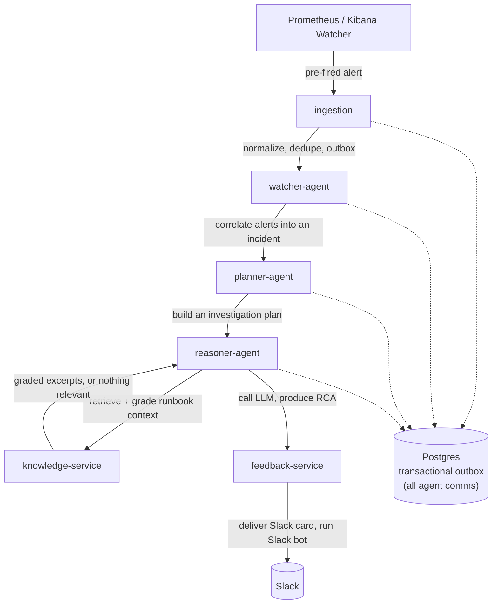

# 🛰️ RADAR

**Real-time Anomaly Detection and Automated Response**

RADAR is an AI-powered Incident Intelligence Platform for SRE workflows. It ingests
pre-fired alerts from Prometheus and Kibana, correlates them into incidents using
configurable rules, retrieves relevant runbooks, reasons over root causes using an LLM,
delivers a structured root cause analysis (RCA) to the on-call engineer via Slack,
collects feedback on that RCA, and answers status queries through a Slack bot.

---

## 🧩 The Problem

When an alert fires at 3am, the on-call engineer's first ten minutes look the same
every time. Find the right runbook, correlate it with whatever else just fired, figure
out what changed recently, and decide where to start looking. That triage work is
repetitive, time pressured, and rarely gets captured anywhere once the incident is
over.

RADAR automates that first ten minutes. It doesn't replace the engineer's judgment. It
gets them to an informed starting point faster, with a documented trail of what was
correlated, what was retrieved, and what was recommended.

**RCAs are grounded in your own runbooks — and say so when they aren't.** Retrieved
excerpts are graded for whether they actually address the incident, not merely whether
they look similar to it. When nothing in the corpus fits, the RCA reasons from the
incident and the investigation plan and states that no runbook covers this, rather than
citing the closest wrong one. An invented runbook reads exactly like a real one to an
engineer following it at 3am.

---

## 🚫 What RADAR Is Not

| | |
|---|---|
| **Not a detection system** | Prometheus alerting rules and Kibana Watcher decide when something is wrong. RADAR only acts on alerts they've already fired. |
| **Not an autonomous remediator** | RADAR recommends. It never executes changes against production systems. |
| **Not a general purpose agent framework** | The agent pipeline (Watcher, Planner, Reasoner) is a fixed sequence built for incident triage — the Reasoner consults a knowledge service for runbook context, but no agent decides what to do next. It is not a platform for arbitrary agent workflows. |
| **Not a ticketing system** | Incident state lives in Postgres. There's no Jira/ServiceNow integration. |

---

## ⚙️ How It Works

Agents never talk to each other directly over HTTP. Every handoff between them is a row
written to a Postgres outbox table, picked up by a dedicated outbox worker, and
dispatched with retries and idempotency guarantees. See
[docs/architecture/agent-pipeline.md](docs/architecture/agent-pipeline.md).

---

## 🛒 Domain

The target system is a stubbed e-commerce `order-service`. Realistic failure modes,
order processing failures, checkout timeouts, inventory latency, payment gateway
errors, memory pressure, drive the alert scenarios, the runbooks, and the demo
narrative. See [docs/architecture/system-overview.md](docs/architecture/system-overview.md).

---

## 📍 Status

RADAR is built incrementally, one phase at a time, with each phase landing as its own
PR. See [docs/roadmap.md](docs/roadmap.md) for the full phase breakdown and
[docs/implementation_plan.md](docs/implementation_plan.md) for the complete technical
specification.

---

## 📚 Documentation

| Path | Purpose |
|---|---|
| [`docs/adr/`](docs/adr/) | Architectural decision records: why, not just what |
| [`docs/architecture/`](docs/architecture/) | System overview, agent pipeline, data model, sequence flows |
| [`docs/operations/`](docs/operations/) | Runbooks for operating RADAR itself |
| [`docs/runbooks/`](docs/runbooks/) | Runbooks about the target services RADAR reasons over |
| [`docs/glossary.md`](docs/glossary.md) | Terminology used throughout the codebase and docs |
| [`docs/roadmap.md`](docs/roadmap.md) | Phase by phase build plan |

---

## 📄 License

MIT. See [LICENSE](LICENSE).
