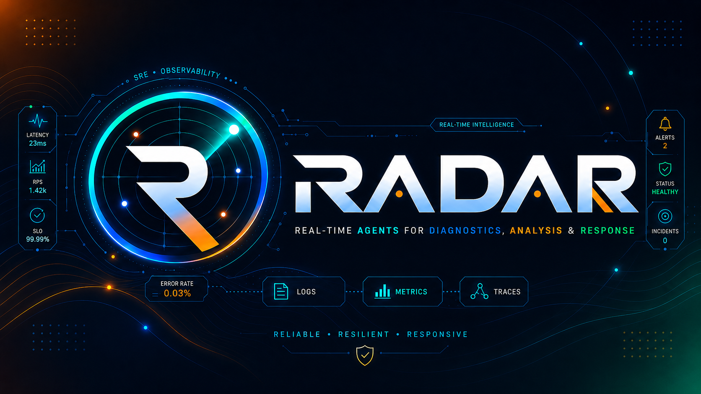
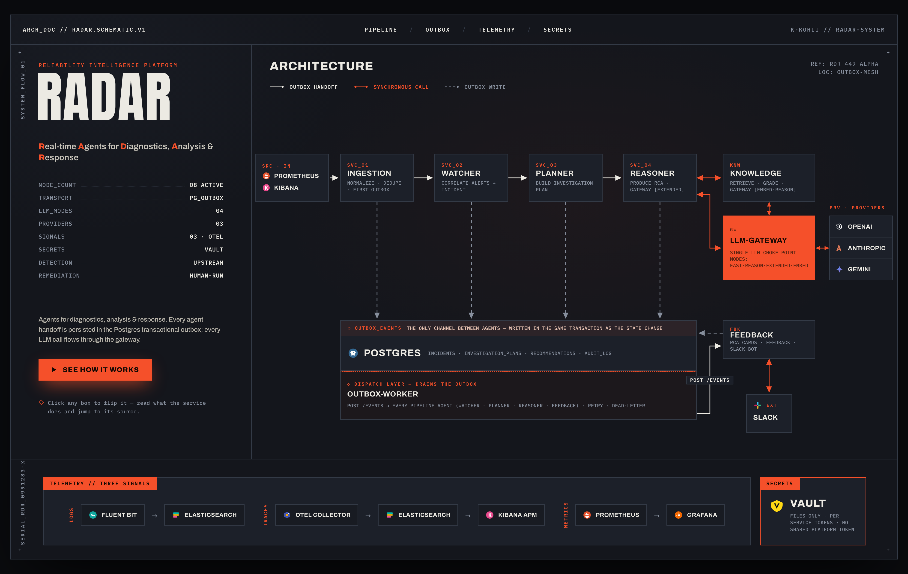
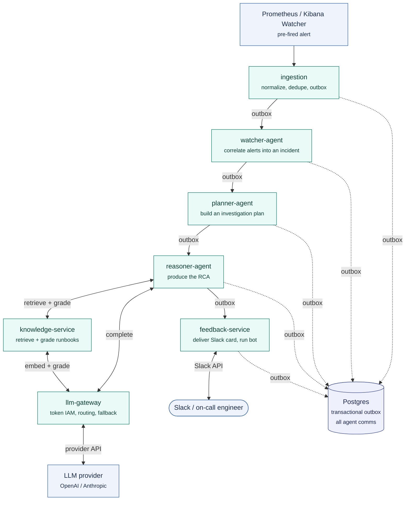

<p align="center">
  
</p>

<p align="center">
  <a href="https://github.com/k-kohli10/radar-system/actions/workflows/ci.yml"></a>
  <a href="https://github.com/k-kohli10/radar-system/releases"></a>
  <a href="LICENSE"></a>
  <a href="https://www.python.org/"></a>
  <a href="https://fastapi.tiangolo.com/"></a>
  <a href="https://www.postgresql.org/"></a>
  <a href="https://docs.astral.sh/ruff/"></a>
  <a href="#-stack"></a>
</p>

RADAR is an AI-powered reliability intelligence platform for SRE workflows. It ingests
pre-fired alerts from your monitoring stack, correlates them into incidents using
configurable rules, retrieves relevant runbooks, reasons over root causes with an LLM,
delivers a structured root cause analysis (RCA) to the on-call engineer in Slack,
collects feedback on it, and answers status queries through a Slack bot.

> **No orchestration framework.** The agents, the Postgres outbox bus, and every
> LLM call are written directly: No LangChain, LangGraph, or LiteLLM.

## Contents

- [The Problem](#-the-problem)
- [Scope](#-scope)
- [How It Works](#-how-it-works)
- [Run It](#-run-it)
- [Domain](#-domain)
- [Stack](#-stack)
- [Documentation](#-documentation)
- [FAQ](#-faq)
- [Contributing](#-contributing)
- [License](#-license)

---

## 🧩 The Problem

When an alert fires at 3am, the on-call engineer spends the first ten minutes the same
way every time: find the right runbook, correlate it with whatever else fired, work out
what changed recently, and decide where to look first. That triage is repetitive, time
pressured, and rarely captured once the incident closes.

RADAR automates that first ten minutes and keeps the engineer in control. It reaches an
informed starting point faster, with a documented trail of what was correlated, what was
retrieved, and what was recommended.

RCAs stay grounded in your own runbooks. Retrieved excerpts are graded for whether they
actually address the incident, so a close-but-wrong runbook stays out. When the corpus
has nothing that fits, the RCA reasons from the incident and the investigation plan and
says plainly that no runbook covers it. An invented runbook reads exactly like a real one
to an engineer following it at 3am, so RADAR states its grounding every time.

---

## 🎯 Scope

RADAR focuses on incident triage and keeps clear boundaries:

| Boundary | Detail |
|---|---|
| **Detection stays upstream** | Prometheus alerting rules and Kibana Watcher decide when something is wrong. RADAR acts on the alerts they fire. |
| **Recommends, humans execute** | RADAR produces an RCA and recommended actions. A human runs any change against production. |
| **A fixed triage pipeline** | Watcher → Planner → Reasoner is a purpose-built sequence for incident triage. The Reasoner consults the knowledge service for runbook context. |
| **Postgres is the system of record** | Incident state lives in Postgres, with a transactional outbox as the agent message bus. |

---

## 🔧 How It Works

The full system, top to bottom (click to zoom):

<p align="center">
  
</p>

<p align="center">
  <a href="https://raw.githack.com/k-kohli10/radar-system/main/docs/architecture/radar-architecture-diagram.html"><strong>▶ Open the interactive schematic</strong></a><br>
  <sub>Flip any service box to read what it does and jump to its source.</sub>
</p>

Zoomed in on the pipeline itself, labeled by arrow type:



The pipeline runs top to bottom, starting when a pre-fired alert reaches ingestion. Three
arrow types carry it:

1. **Solid one-way (agent → agent) — an asynchronous outbox handoff.** The source agent
   commits its state change and an outbox row in a single transaction; a dedicated
   outbox-worker later picks up that row and dispatches it to the next agent, with retries
   and idempotency guarantees.
2. **Solid two-way — a synchronous request/response call.** These are:
   - reasoner ↔ knowledge-service — retrieve and grade runbook context
   - reasoner ↔ llm-gateway — produce the RCA
   - knowledge-service ↔ llm-gateway — embed queries and grade retrieved chunks
   - feedback-service ↔ Slack — post cards and take the engineer's responses back
3. **Dashed one-way — the outbox write** landing durably in Postgres.

Two rules follow from this:

- **Every LLM call flows through llm-gateway**, the single point of contact with the
  external provider.
- **The outbox is the sole handoff path between pipeline agents.** The reasoner's and
  knowledge-service's synchronous calls target supporting services (knowledge-service,
  llm-gateway) and are queries, not pipeline handoffs.

See [docs/architecture/agent-pipeline.md](docs/architecture/agent-pipeline.md).

---

## 🚀 Run It

**New here? → [15-minute quickstart](docs/quickstart.md)** takes a clean machine
from clone to a live RCA, step by step.

Two ways to run the full stack locally, both from one bootstrap:

```bash
scripts/bootstrap.sh                # checks tools, installs uv, generates .env
# set OPENAI_API_KEY in .env (and SLACK_* for the Slack bot)
make docker-up                      # bring up the whole stack in Docker
make agent-secrets && make index    # index runbooks: knowledge-service ready, grounded RCAs
```

Then fire an alert and watch the RCA land in Slack and Postgres. Full walkthrough:

- **Docker (two-stack):** [docs/operations/docker.md](docs/operations/docker.md). One command up, plus the end-to-end test.
- **Native dev:** [docs/local-development.md](docs/local-development.md). Services on the host for a fast edit loop.
- **Kubernetes:** [docs/operations/kubernetes-cd.md](docs/operations/kubernetes-cd.md). A Helm chart (`deploy/helm/radar`, plus `deploy/helm/platform-deps`) deployed to a managed cluster by a manual, approval-gated GitHub Actions workflow.

---

## 🛒 Domain

The target system is a stubbed e-commerce `order-service`. Its realistic failure modes
(order-processing failures, checkout timeouts, inventory latency, payment-gateway errors,
memory pressure) drive the alert scenarios, the runbooks, and the demo narrative. See
[docs/architecture/system-overview.md](docs/architecture/system-overview.md).

---

## 🧱 Stack

Python 3.14 across uv workspaces. Each service is FastAPI + Pydantic v2 over
SQLAlchemy async, with structlog for logging.

| Role | Choice |
|---|---|
| **Inter-agent bus** | A Postgres transactional outbox: the only channel between agents. |
| **Secrets** | HashiCorp Vault secret files, never environment variables. |
| **LLM / agent code** | Written directly against the provider. No LangChain, LangGraph, LiteLLM, or other orchestration framework. |

The outbox keeps every handoff durable, atomic, and idempotent in the same
database that holds incident state, so RADAR needs no separate broker to
coordinate agents. Keeping the LLM and agent code framework-free keeps the
control flow explicit and the dependency surface small.

---

## 📚 Documentation

| Path | Purpose |
|---|---|
| [`docs/quickstart.md`](docs/quickstart.md) | 15-minute clone-to-RCA walkthrough |
| [`docs/plugin-development.md`](docs/plugin-development.md) | Add a new LLM/notification/logs/metrics/traces backend |
| [`docs/performance-benchmark.md`](docs/performance-benchmark.md) | 100-alert burst on Kubernetes with the real LLM: latency + no-data-loss |
| [`docs/local-development.md`](docs/local-development.md) | Run the stack locally, native or Docker |
| [`docs/operations/docker.md`](docs/operations/docker.md) | The two-stack Docker workflow and end-to-end test |
| [`docs/adr/`](docs/adr/) | Architectural decision records: the why behind each choice |
| [`docs/architecture/`](docs/architecture/) | System overview, agent pipeline, data model, sequence flows, observability |
| [`docs/operations/`](docs/operations/) | Runbooks for operating RADAR itself |
| [`docs/runbooks/`](docs/runbooks/) | Runbooks about the target services RADAR reasons over |
| [`docs/glossary.md`](docs/glossary.md) | Terminology used across the codebase and docs |
| [`docs/roadmap.md`](docs/roadmap.md) | What's shipped, what's next |
| [`CHANGELOG.md`](CHANGELOG.md) | What shipped, milestone by milestone |
| [`CONTRIBUTING.md`](CONTRIBUTING.md) | Ground rules, dev setup, and PR expectations |

---

## ❓ FAQ

<details>
<summary><b>1. Does RADAR take automated remediation action?</b></summary>

> No. It produces an RCA and recommended actions; a human runs any change
> against production.

</details>

<details>
<summary><b>2. Do the agents call each other directly?</b></summary>

> No. Pipeline handoffs (watcher → planner → reasoner → feedback) go only
> through the Postgres transactional outbox. The reasoner's synchronous calls to
> knowledge-service and llm-gateway are queries to supporting services, not
> pipeline handoffs. See
> [docs/architecture/agent-pipeline.md](docs/architecture/agent-pipeline.md).

</details>

<details>
<summary><b>3. Why a Postgres outbox instead of Redis or Kafka?</b></summary>

> The state change and its outbox event commit in one database transaction, so a
> handoff can never be half-done — "incident created but no plan requested" is
> structurally impossible. It also means no extra broker infrastructure. See
> [docs/adr/0003-postgres-outbox.md](docs/adr/0003-postgres-outbox.md).

</details>

<details>
<summary><b>4. What happens if the LLM provider is unavailable?</b></summary>

> The reasoner falls back to a template RCA (`is_fallback=true`,
> `confidence=low`) that explains the AI was unavailable and lists the
> investigation steps. An incident is never left without a recommendation. See
> [docs/adr/0004-llm-gateway.md](docs/adr/0004-llm-gateway.md).

</details>

<details>
<summary><b>5. What happens if the knowledge service (retrieval) is down?</b></summary>

> The reasoner proceeds with an empty context and still calls the LLM,
> producing a genuine but ungrounded RCA — not a template. Losing retrieval
> costs the incident its grounding, not its analysis. See
> [docs/architecture/sequence-flows.md](docs/architecture/sequence-flows.md).

</details>

<details>
<summary><b>6. Which LLM providers are supported?</b></summary>

> OpenAI, Anthropic, and Gemini, via config-driven plugins behind the
> llm-gateway, which owns per-mode routing and provider fallback. See
> [docs/plugin-development.md](docs/plugin-development.md).

</details>

<details>
<summary><b>7. Can I add my own backend (LLM, notification, logs, metrics, traces)?</b></summary>

> Yes. Backends are plugins resolved at runtime against Protocol interfaces in
> `radar_contracts`; nothing in `apps/` or `packages/` imports a vendor client
> directly — vendor SDKs live behind `plugins/`. See
> [docs/plugin-development.md](docs/plugin-development.md).

</details>

<details>
<summary><b>8. How are secrets handled?</b></summary>

> At runtime each service reads secret *files* that Vault mounts (default
> `/vault/secrets`, overridable with `RADAR_SECRETS_DIR` for local dev) — secret
> values never come from the service's own environment. External credentials like
> your OpenAI and Slack keys are seeded into Vault first (locally from `.env`, in
> CI/CD from GitHub Actions secrets) and materialized as those files. Each service
> then authenticates with its own per-service token; there is no shared platform
> token.

</details>

<details>
<summary><b>9. Can I point RADAR at my own Vault, Postgres, or Elasticsearch?</b></summary>

> Yes — that is the production pattern. Run RADAR's app chart against your own
> managed backends and skip the bundled `platform-deps`: set `vault.addr` (in
> the Helm values) to your own or HCP Vault, `RADAR_ELASTICSEARCH_URL` to your
> Elasticsearch, and store your Postgres DSN at `secret/radar/postgres` (with
> `vault.postgresHost` set to your database host). LLM routing lives in the
> gateway config. See
> [deploy/examples/bring-your-own-backends/README.md](deploy/examples/bring-your-own-backends/README.md)
> and [docs/operations/secrets.md](docs/operations/secrets.md).

</details>

<details>
<summary><b>10. Can I run it without Kubernetes?</b></summary>

> Yes. The whole stack runs locally via Docker (two-stack) or natively for a
> fast edit loop. See [docs/quickstart.md](docs/quickstart.md) for the Docker
> path and [docs/local-development.md](docs/local-development.md) for native dev.

</details>

<details>
<summary><b>11. How do I trace a single incident end to end?</b></summary>

> Every log line and span carries a `correlation_id` minted at ingress; filter
> Kibana Discover on that id to see one incident across logs and traces. (The
> APM Service Map stays empty by design, because agents coordinate through the
> outbox rather than calling each other.) See
> [docs/architecture/observability.md](docs/architecture/observability.md).

</details>

---

## 🤝 Contributing

Contributions are welcome. A handful of architectural decisions are locked —
settled, and best treated as fixed when you open a PR:

- Agents are hand-written against the provider SDK.
- Agents communicate through the Postgres transactional outbox.
- Secrets come from HashiCorp Vault secret files, mounted at runtime.

They're locked because they keep the system small and predictable, and each
one's reasoning is written down: read [docs/adr/](docs/adr/) before proposing to
change it, and read [CONTRIBUTING.md](CONTRIBUTING.md) before opening a PR. Found
a bug or have a question? [Open an issue](../../issues).

---

## 📄 License

MIT. See [LICENSE](LICENSE).
