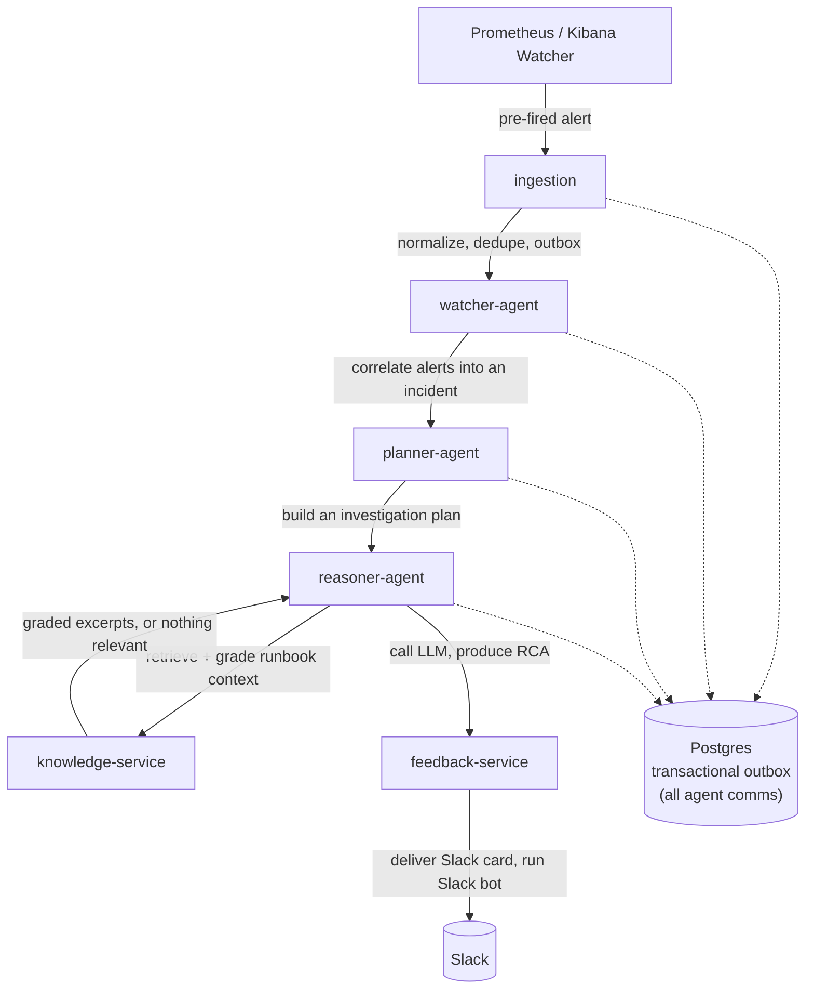

# 🛰️ RADAR

**Real-time Anomaly Detection and Automated Response**

[](LICENSE)
[](https://www.python.org/)

RADAR is an AI-powered incident intelligence platform for SRE workflows. It ingests
pre-fired alerts from Prometheus and Kibana, correlates them into incidents using
configurable rules, retrieves relevant runbooks, reasons over root causes with an LLM,
delivers a structured root cause analysis (RCA) to the on-call engineer in Slack,
collects feedback on it, and answers status queries through a Slack bot.

## Contents

- [The Problem](#-the-problem)
- [Scope](#-scope)
- [How It Works](#-how-it-works)
- [Run It](#-run-it)
- [Domain](#-domain)
- [Stack](#-stack)
- [Status](#-status)
- [Documentation](#-documentation)
- [License](#-license)

---

## 🧩 The Problem

When an alert fires at 3am, the on-call engineer spends the first ten minutes the same
way every time: find the right runbook, correlate it with whatever else fired, work out
what changed recently, and decide where to look first. That triage is repetitive, time
pressured, and rarely captured once the incident closes.

RADAR automates that first ten minutes and keeps the engineer in control. It reaches an
informed starting point faster, with a documented trail of what was correlated, what was
retrieved, and what was recommended.

RCAs stay grounded in your own runbooks. Retrieved excerpts are graded for whether they
actually address the incident, so a close-but-wrong runbook stays out. When the corpus
has nothing that fits, the RCA reasons from the incident and the investigation plan and
says plainly that no runbook covers it. An invented runbook reads exactly like a real one
to an engineer following it at 3am, so RADAR states its grounding every time.

---

## 🎯 Scope

RADAR focuses on incident triage and keeps clear boundaries:

| Boundary | Detail |
|---|---|
| **Detection stays upstream** | Prometheus alerting rules and Kibana Watcher decide when something is wrong. RADAR acts on the alerts they fire. |
| **Recommends, humans execute** | RADAR produces an RCA and recommended actions. A human runs any change against production. |
| **A fixed triage pipeline** | Watcher → Planner → Reasoner is a purpose-built sequence for incident triage. The Reasoner consults the knowledge service for runbook context. |
| **Postgres is the system of record** | Incident state lives in Postgres, with a transactional outbox as the agent message bus. |

---

## 🔧 How It Works



Agents coordinate through a Postgres outbox. Every handoff is a row a dedicated outbox
worker picks up and dispatches with retries and idempotency guarantees. See
[docs/architecture/agent-pipeline.md](docs/architecture/agent-pipeline.md).

---

## 🚀 Run It

**New here? → [15-minute quickstart](docs/quickstart.md)** takes a clean machine
from clone to a live RCA, step by step.

Two ways to run the full stack locally, both from one bootstrap:

```bash
scripts/bootstrap.sh                # checks tools, installs uv, generates .env
# set OPENAI_API_KEY in .env (and SLACK_* for the Slack bot)
make docker-up                      # bring up the whole stack in Docker
make agent-secrets && make index    # index runbooks: knowledge-service ready, grounded RCAs
```

Then fire an alert and watch the RCA land in Slack and Postgres. Full walkthrough:

- **Docker (two-stack):** [docs/operations/docker.md](docs/operations/docker.md). One command up, plus the end-to-end test.
- **Native dev:** [docs/local-development.md](docs/local-development.md). Services on the host for a fast edit loop.
- **Kubernetes:** [docs/operations/kubernetes-cd.md](docs/operations/kubernetes-cd.md). A Helm chart (`deploy/helm/radar`, plus `deploy/helm/platform-deps`) deployed to a managed cluster by a manual, approval-gated GitHub Actions workflow.

---

## 🛒 Domain

The target system is a stubbed e-commerce `order-service`. Its realistic failure modes
(order-processing failures, checkout timeouts, inventory latency, payment-gateway errors,
memory pressure) drive the alert scenarios, the runbooks, and the demo narrative. See
[docs/architecture/system-overview.md](docs/architecture/system-overview.md).

---

## 🧱 Stack

Python 3.14 across uv workspaces. Each service is FastAPI + Pydantic v2 over
SQLAlchemy async, with structlog for logging.

| Role | Choice |
|---|---|
| **Inter-agent bus** | A Postgres transactional outbox — the only channel between agents. No Redis, no external message broker. |
| **Secrets** | HashiCorp Vault secret files, never environment variables. |
| **LLM / agent code** | Written directly against the provider. No LangChain, LangGraph, LiteLLM, or other orchestration framework. |

The outbox keeps every handoff durable, atomic, and idempotent in the same
database that holds incident state, so RADAR needs no separate broker to
coordinate agents. Keeping the LLM and agent code framework-free keeps the
control flow explicit and the dependency surface small.

---

## 📍 Status

RADAR is a working end-to-end system. Phases 0–13 are complete — the full
pipeline, observability, CI, Kubernetes deployment, and security hardening — and
Phase 14, docs and release polish toward the v1.0 tag, is in progress. See
[docs/roadmap.md](docs/roadmap.md) for the phase-by-phase breakdown and its release
tags, and [docs/implementation_plan.md](docs/implementation_plan.md) for the full
technical specification.

---

## 📚 Documentation

| Path | Purpose |
|---|---|
| [`docs/quickstart.md`](docs/quickstart.md) | 15-minute clone-to-RCA walkthrough |
| [`docs/plugin-development.md`](docs/plugin-development.md) | Add a new LLM/notification/logs/metrics/traces backend |
| [`docs/performance-benchmark.md`](docs/performance-benchmark.md) | 100-alert burst on Kubernetes with the real LLM: latency + no-data-loss |
| [`docs/local-development.md`](docs/local-development.md) | Run the stack locally, native or Docker |
| [`docs/operations/docker.md`](docs/operations/docker.md) | The two-stack Docker workflow and end-to-end test |
| [`docs/adr/`](docs/adr/) | Architectural decision records: the why behind each choice |
| [`docs/architecture/`](docs/architecture/) | System overview, agent pipeline, data model, sequence flows, observability |
| [`docs/operations/`](docs/operations/) | Runbooks for operating RADAR itself |
| [`docs/runbooks/`](docs/runbooks/) | Runbooks about the target services RADAR reasons over |
| [`docs/glossary.md`](docs/glossary.md) | Terminology used across the codebase and docs |
| [`docs/roadmap.md`](docs/roadmap.md) | Phase by phase build plan |

---

## 📄 License

MIT. See [LICENSE](LICENSE).
