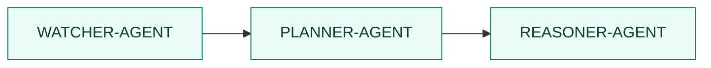
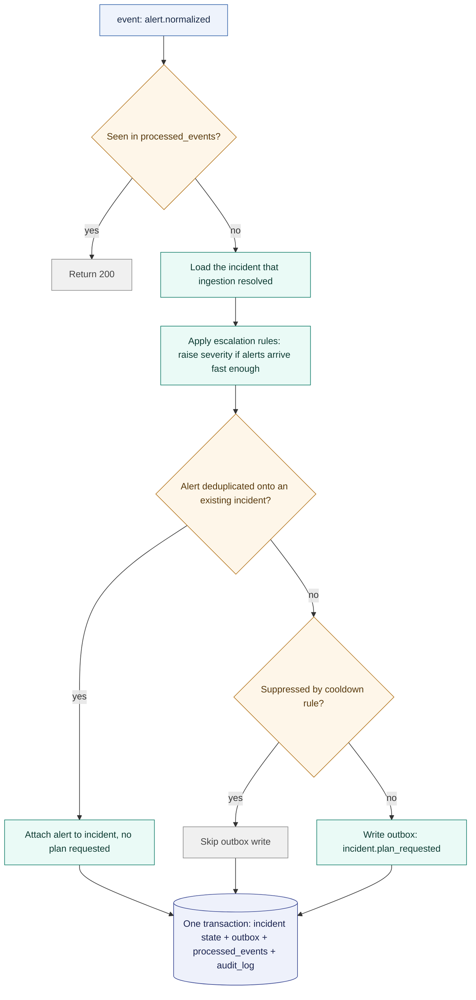
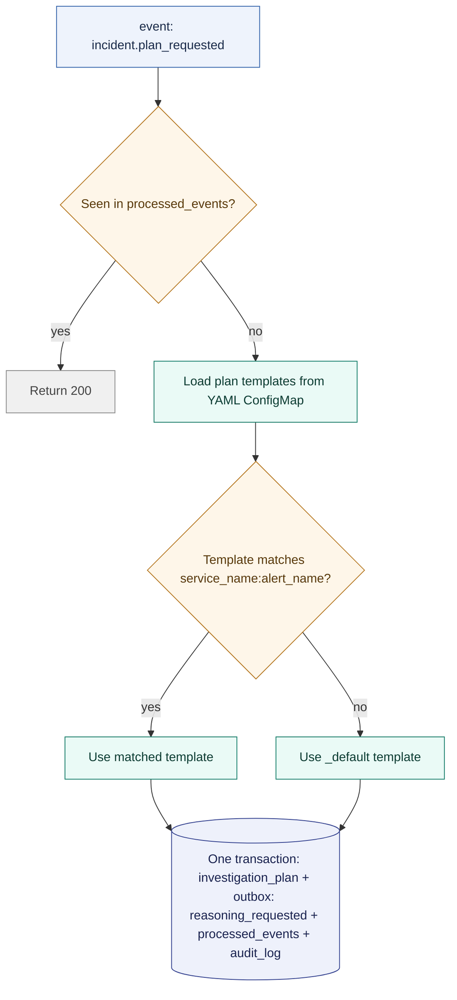
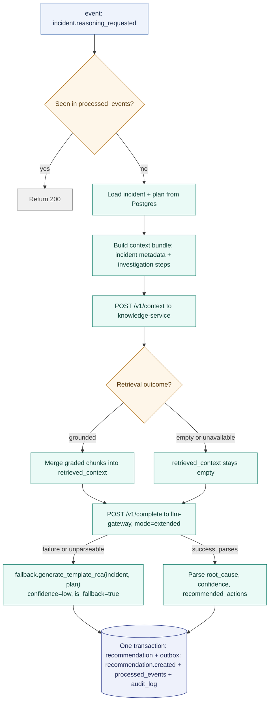

# 🔗 Agent Pipeline

## Contents

- [Pipeline Shape](#-pipeline-shape)
- [Why No Direct HTTP Between Agents](#-why-no-direct-http-between-agents)
- [POST /events Contract](#-post-events-contract)
- [Watcher Agent](#-watcher-agent)
- [Planner Agent](#-planner-agent)
- [Reasoner Agent](#-reasoner-agent)
- [Idempotency](#-idempotency)

## 🔲 Pipeline Shape



Three fixed, linear stages. Each is a purpose-built service that does one job and
hands off to the next through the outbox.

## 🚦 Why No Direct HTTP Between Agents

Agents communicate exclusively through a Postgres transactional outbox, dispatched by a
dedicated outbox-worker. An agent never calls another agent's HTTP endpoint directly to
trigger a handoff. See [docs/adr/0003-postgres-outbox.md](../adr/0003-postgres-outbox.md)
for the reasoning. In short: the outbox makes "incident created but no plan requested"
and "plan requested but incident never created" structurally impossible, because the
state change and the event write happen in the same database transaction.

This rule governs pipeline handoffs: the state transitions between watcher-agent,
planner-agent, and reasoner-agent. The reasoner also queries `llm-gateway` and
`knowledge-service` synchronously. These are supporting services (they consume no
events and emit none), so a request/response call to one is a query: the reasoner needs
the answer to proceed. This is the canonical description of the boundary; other docs
link here rather than restate it.

## 📨 POST /events Contract

Every agent exposes the same inbound contract for outbox-worker to dispatch into:

```
POST /events
Header: X-Radar-Agent-Token: <token>

Body:
{
  "event_id": "uuid",
  "event_type": "alert.normalized",
  "correlation_id": "uuid",
  "payload": {}
}

200 → processed, or already seen (idempotent)
401 → bad token
422 → malformed payload
```

## 👁️ Watcher Agent

Correlates raw alerts into incidents.



Fingerprinting and deduplication happen upstream, in ingestion, on its 5-minute window;
by the time an event reaches the watcher, ingestion has already decided which incident
it belongs to. The watcher's own correlation rules live in
`apps/watcher-agent/config/correlation-rules.yaml`, mounted as a ConfigMap. Suppression
and escalation are the rules it applies; window overrides, service groups, and
fingerprint fields are validated and carried in the same file but applied by nothing yet
(see [ADR 0013](../adr/0013-watcher-correlation-scope.md)).

## 🗺️ Planner Agent

Builds an investigation plan from a template, no LLM call.



Templates live in `apps/planner-agent/config/plan-templates.yaml`.

## 🧠 Reasoner Agent

The only stage that calls an LLM.



Both remote calls, to `knowledge-service` and to `llm-gateway`, sit outside the
transaction, since they're external network calls. An incident is never left without a
recommendation, whether retrieval comes back grounded, empty, or unavailable. See
[docs/adr/0004-llm-gateway.md](../adr/0004-llm-gateway.md) for the fallback chain in
full and [sequence-flows.md](sequence-flows.md#1-happy-path-alert-to-rca-in-slack) for
the three retrieval outcomes.

## ♻️ Idempotency

Every stage checks `processed_events` (keyed on `event_id` + the processing service's
name) before doing any work, and writes its own `processed_events` row in the same
transaction as its other state changes. Combined with outbox-worker's
`SELECT ... FOR UPDATE SKIP LOCKED` polling, an event is processed exactly once per
agent even under concurrent workers or retried dispatches.
