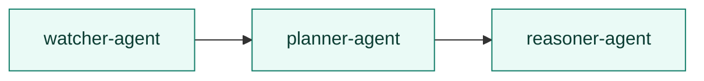
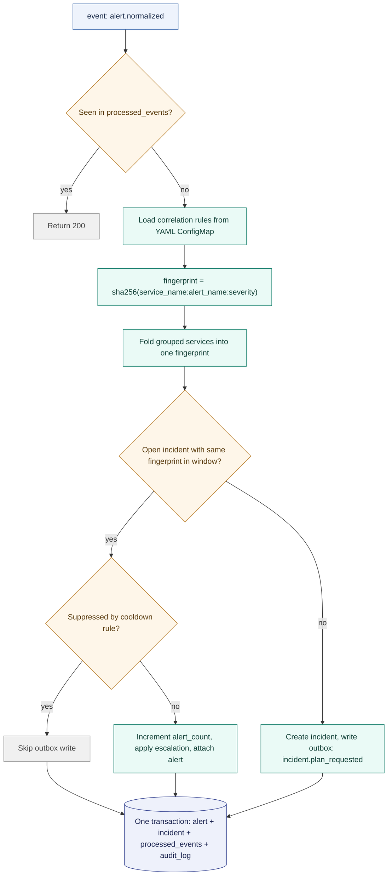
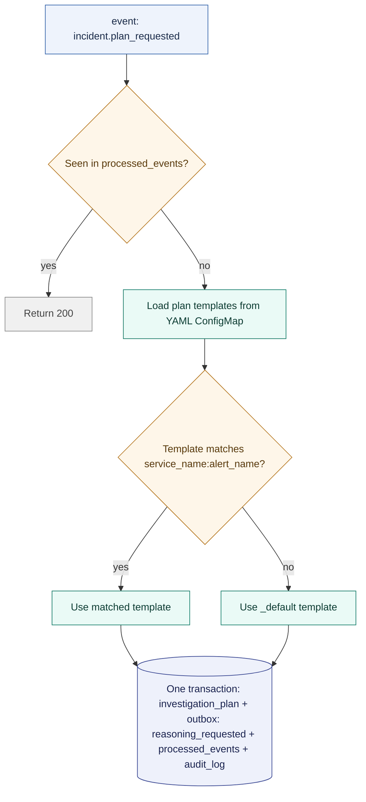
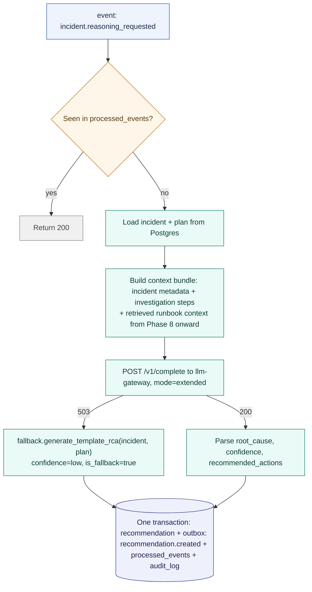

# 🔗 Agent Pipeline

## Contents

- 🔲 [Pipeline Shape](#pipeline-shape)
- 🚦 [Why No Direct HTTP Between Agents](#why-no-direct-http-between-agents)
- 📨 [POST /events Contract](#post-events-contract)
- 👁️ [Watcher Agent](#watcher-agent)
- 🗺️ [Planner Agent](#planner-agent)
- 🧠 [Reasoner Agent](#reasoner-agent)
- ♻️ [Idempotency](#idempotency)

## Pipeline Shape



Fixed, linear, three stages. Not a graph, not a framework. Just a sequence of
purpose-built services that each do one job and hand off through the outbox.

## Why No Direct HTTP Between Agents

Agents communicate exclusively through a Postgres transactional outbox, dispatched by a
dedicated outbox-worker. An agent never calls another agent's HTTP endpoint directly to
trigger a handoff. See [docs/adr/0003-postgres-outbox.md](../adr/0003-postgres-outbox.md)
for the reasoning. In short: the outbox makes "incident created but no plan requested"
and "plan requested but incident never created" structurally impossible, because the
state change and the event write happen in the same database transaction.

This rule governs pipeline handoffs — the state transitions between watcher-agent,
planner-agent, and reasoner-agent. It is not violated by the reasoner's synchronous calls
to `llm-gateway` and `knowledge-service`: those are supporting services, not stages in the
pipeline (they consume no events and emit none), so a request/response call to one is not
an agent-to-agent handoff and never was in scope for the rule. The reasoner needs the LLM's
answer to proceed, so that call is a direct query, not a fire-and-forget event.

## POST /events Contract

Every agent exposes the same inbound contract for outbox-worker to dispatch into:

```
POST /events
Header: X-Radar-Agent-Token: <token>

Body:
{
  "event_id": "uuid",
  "event_type": "alert.normalized",
  "correlation_id": "uuid",
  "payload": {}
}

200 → processed, or already seen (idempotent)
401 → bad token
422 → malformed payload
```

## Watcher Agent

Correlates raw alerts into incidents.



Correlation rules (window overrides, service groups, suppression, escalation,
fingerprint fields) live in `apps/watcher-agent/config/correlation-rules.yaml`, mounted
as a ConfigMap. Never hardcoded.

## Planner Agent

Builds an investigation plan from a template, no LLM call.



Templates live in `apps/planner-agent/config/plan-templates.yaml`.

## Reasoner Agent

The only stage that calls an LLM.



The LLM call itself sits outside the transaction, since it's an external network call.
An incident is never left without a recommendation. See
[docs/adr/0004-llm-gateway.md](../adr/0004-llm-gateway.md) for the fallback chain in
full.

## Idempotency

Every stage checks `processed_events` (keyed on `event_id` + the processing service's
name) before doing any work, and writes its own `processed_events` row in the same
transaction as its other state changes. Combined with outbox-worker's
`SELECT ... FOR UPDATE SKIP LOCKED` polling, an event is processed exactly once per
agent even under concurrent workers or retried dispatches.
