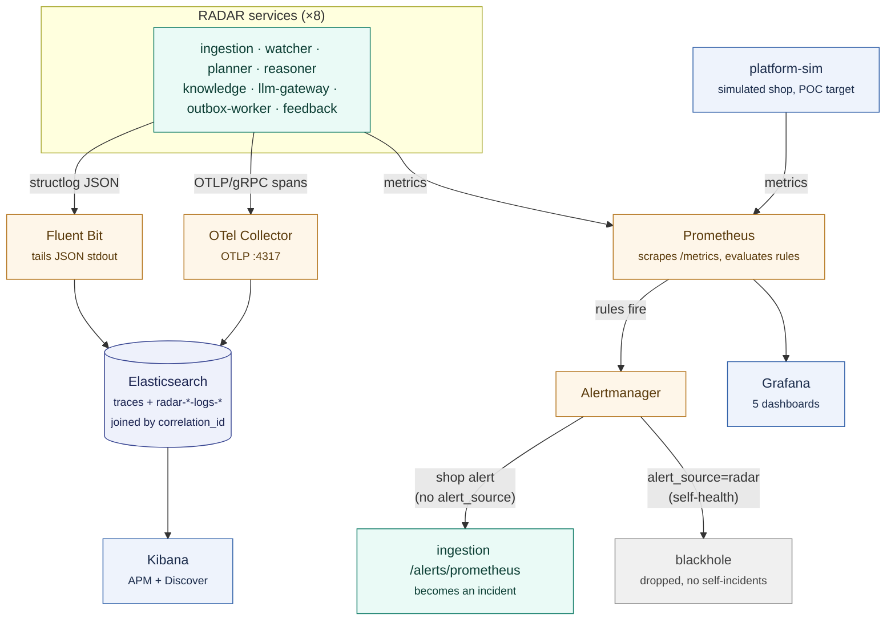

# 🔭 Observability Architecture

How RADAR's three telemetry signals (metrics, traces, logs) are collected, stored,
and viewed, and the one structural distinction that the incident-pipeline diagrams do
not show: the difference between watching **the simulated shop** and watching **RADAR
itself**.

Both are scraped by the same Prometheus, but they exist for opposite reasons:

- **The shop** (`platform-sim`) is the thing being monitored. A breach of its metrics
  is supposed to **become an incident** for RADAR to work on.
- **RADAR itself** is the monitor. A breach of its own service-health metrics must
  **never** become an incident, or the reasoner would be filing incidents about the
  reasoner. RADAR's self-alerts are routed to a blackhole for exactly this reason.

For the incident data-flow plane (alerts to agents to Slack), see
[system-overview.md](system-overview.md), [agent-pipeline.md](agent-pipeline.md), and
[sequence-flows.md](sequence-flows.md). This document is the telemetry plane only.

## Contents

- 🔀 [The pipeline](#the-pipeline)
- 📈 [Metrics and alerting](#metrics-and-alerting)
- 🧵 [Traces](#traces)
- 📜 [Logs](#logs)
- 🗂️ [Where each signal is configured](#where-each-signal-is-configured)

## The pipeline

Only RADAR services emit all three signals. `platform-sim` exposes `/metrics` and
nothing else: it has no tracing and ships no logs, because it is a POC target, not a
RADAR service.

## Metrics and alerting

Prometheus scrapes `/metrics` from every RADAR service (each target carries a `service`
label) and from `platform-sim`. Two rule files load side by side, and they are kept
physically distinct because they answer different questions:

| Rule file | Watches | On fire |
|---|---|---|
| `deploy/prometheus/alerting-rules.yml` | the simulated shop | Alertmanager forwards to ingestion; becomes an incident |
| `deploy/prometheus/radar-service-alerts.yml` | RADAR's own health | routed to a blackhole; never an incident |

The split is enforced by a single label. RADAR self-alerts carry `alert_source: radar`;
Alertmanager matches that label to the `blackhole` receiver. Shop alerts carry no such
label and fall through to the default `radar` receiver, whose webhook posts to
ingestion's real front door. Routing a self-alert to ingestion would create a
self-monitoring loop (a `RadarAgentDown` alert for the reasoner would become an incident
the reasoner then has to process), which is the loop the blackhole exists to prevent.

RADAR's three self-health alerts are `LLMTemplateFallbackActive` (the LLM path is
degraded and incidents are getting template RCAs), `OutboxBacklogHigh` (the worker is
falling behind), and `RadarAgentDown` (a service is unscrapable).

Grafana reads Prometheus and provisions five dashboards: `radar-overview`,
`incident-pipeline`, `llm-gateway`, `outbox-health`, and `feedback-quality`.

> **Dev-stack note.** In compose, the Alertmanager webhook to ingestion currently 401s:
> ingestion authenticates `/alerts/prometheus` with the `X-Radar-Webhook-Token` header
> (ADR 0011), and Alertmanager v0.27 cannot send an arbitrary custom header. This is a
> known limitation of the compose dev-stack. The scrape-to-fire-to-webhook path is
> proven independently by `tests/e2e/test_real_prometheus_alert.py`.

## Traces

Each RADAR service emits OpenTelemetry spans over OTLP/gRPC to the OTel Collector, which
exports them to Elasticsearch using OTel-native mapping (the `traces-generic-default`
data stream). `correlation_id` rides as a span attribute and lands at
`attributes.correlation_id`, which is the join key the traces plugin
(`plugins/traces/elastic`) queries a whole incident's trace by. See
[ADR 0008](../adr/0008-otel-to-elasticsearch.md).

**Viewing a whole incident's trace: filter Discover on `attributes.correlation_id`, not
the APM Service Map.** RADAR agents do not call each other; they coordinate through the
Postgres outbox, and the outbox write-then-poll hop does not propagate trace context.
Each service therefore emits its own disconnected trace, joined only by the shared
`correlation_id` attribute. So one incident is many `trace_id`s under one
`correlation_id`. The APM Service Map draws edges from cross-service client spans, of
which there are none, so it stays empty; the correlation-id filter in Discover is the
supported trace view.

## Logs

Every service logs structured JSON to stdout via structlog. Fluent Bit tails those lines
(the `.dev-run/<service>.log` files in compose, container stdout in Kubernetes), keeps
only lines that parse as RADAR JSON (a `grep` filter on the presence of a `service`
field drops interleaved uvicorn plain-text lines), and ships each line to a per-service
`radar-<service>-logs-YYYY.MM.DD` index (routed off the `service` field by a Lua filter).
A `radar-*-logs-*` index template pins them to 1 shard / 0 replicas and attaches a 7-day
ILM policy so the ~8-fold per-service split stays shard- and retention-bounded; the logs
plugin (`plugins/logs/elastic`) queries the `radar-*-logs-*` pattern.

Because `correlation_id` is bound on every RADAR log line and also rides on every span,
logs and traces for one incident are queryable by the same key in the same
Elasticsearch, which is the Phase 10 done-condition: a single mock alert is traceable
end to end by `correlation_id` alone.

## Where each signal is configured

| Signal | Emitter | Collector | Store | Viewer | Config |
|---|---|---|---|---|---|
| metrics | `/metrics` on each service | Prometheus scrape | Prometheus TSDB | Grafana | `deploy/prometheus/`, `deploy/grafana/` |
| traces | OTel SDK (`radar_telemetry`) | OTel Collector | Elasticsearch | Kibana APM / Discover | `deploy/otel/` |
| logs | structlog to stdout | Fluent Bit | Elasticsearch | Kibana Discover | `deploy/fluent-bit/` |
