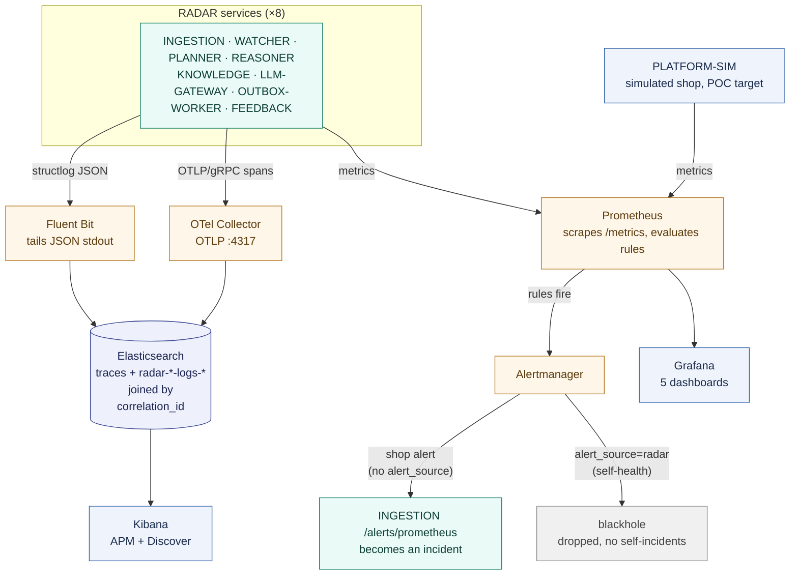
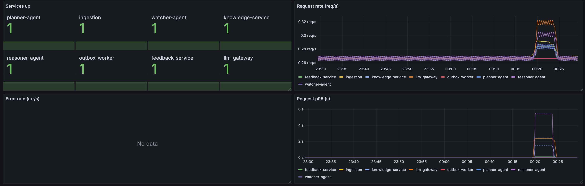
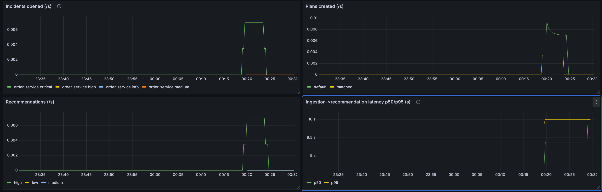
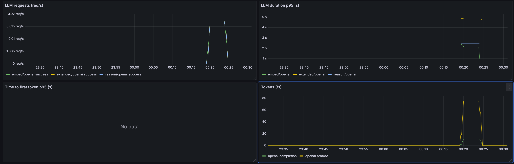
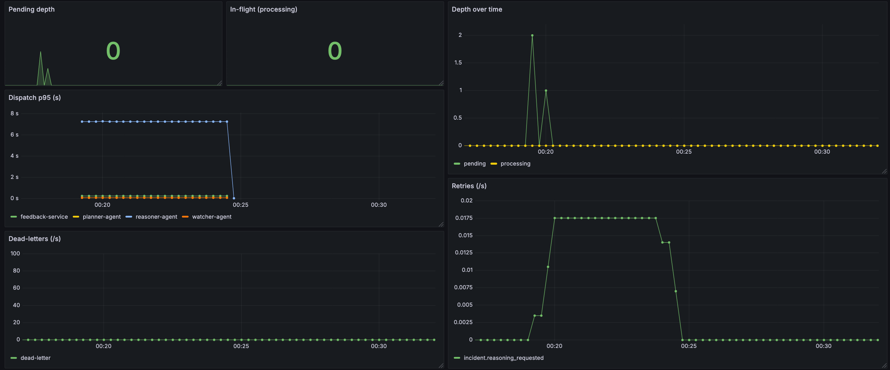
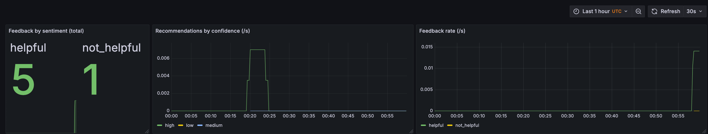
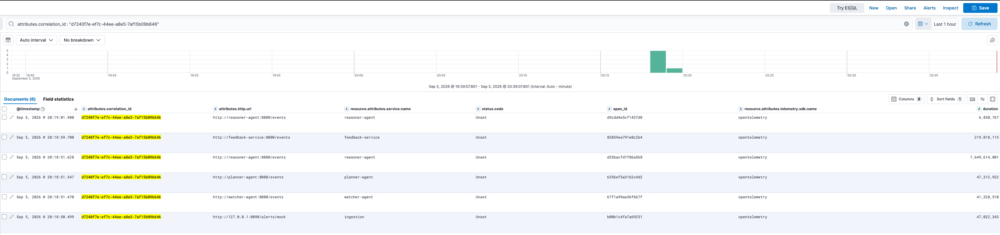
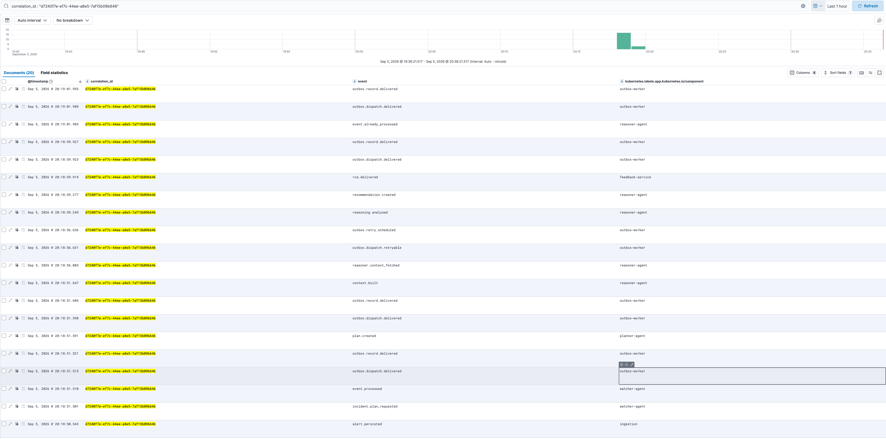
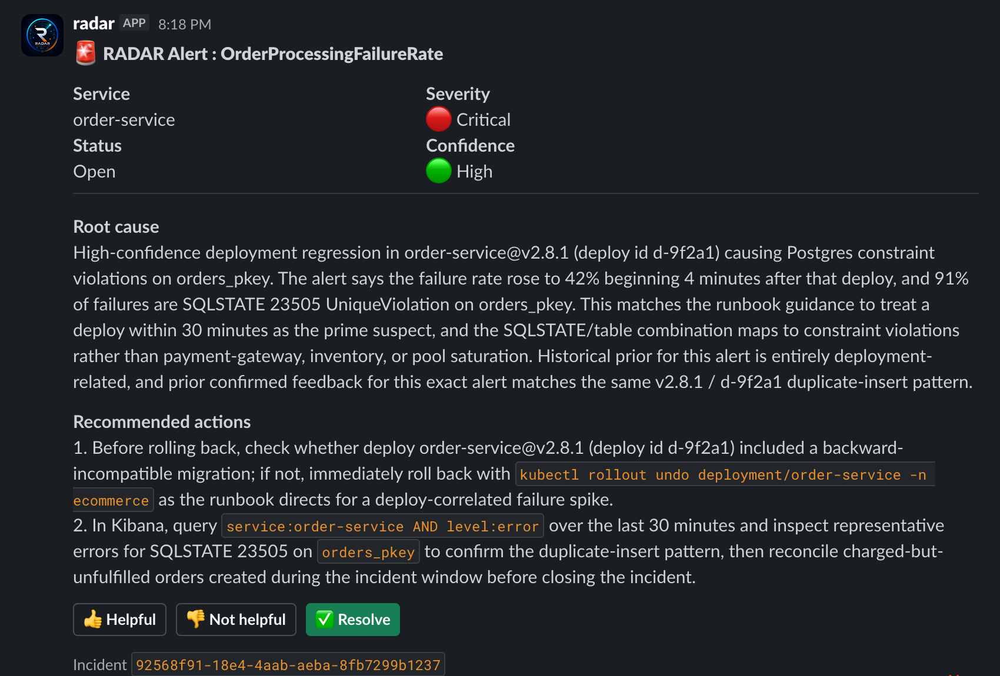

# 🔭 Observability Architecture

This document covers how RADAR's three telemetry signals, metrics, traces, and logs,
are collected, stored, and viewed. It also draws a distinction the incident-pipeline
diagrams do not show: the difference between watching **the simulated shop** and
watching **RADAR itself**.

Both are scraped by the same Prometheus, but they exist for opposite reasons:

- **The shop** (`platform-sim`) is the thing being monitored. A breach of its metrics
  is supposed to **become an incident** for RADAR to work on.
- **RADAR itself** is the monitor. A breach of its own service-health metrics must
  **never** become an incident, or the reasoner would be filing incidents about the
  reasoner. RADAR's self-alerts are routed to a blackhole for exactly this reason.

For the incident data-flow plane (alerts to agents to Slack), see
[system-overview.md](system-overview.md), [agent-pipeline.md](agent-pipeline.md), and
[sequence-flows.md](sequence-flows.md). This document is the telemetry plane only.

## Contents

- [The pipeline](#-the-pipeline)
- [Metrics and alerting](#-metrics-and-alerting)
- [Traces](#-traces)
- [Logs](#-logs)
- [Where each signal is configured](#-where-each-signal-is-configured)
- [The RCA the pipeline delivers](#-the-rca-the-pipeline-delivers)

## 🔀 The pipeline

Only RADAR services emit all three signals. `platform-sim` exposes `/metrics` and
nothing else: it has no tracing and ships no logs, because it is a POC target, not a
RADAR service.

## 📈 Metrics and alerting

Prometheus scrapes `/metrics` from every RADAR service (each target carries a `service`
label) and from `platform-sim`. Two rule files load side by side, and they are kept
physically distinct because they answer different questions:

| Rule file | Watches | On fire |
|---|---|---|
| `deploy/prometheus/alerting-rules.yml` | the simulated shop | Alertmanager forwards to ingestion; becomes an incident |
| `deploy/prometheus/radar-service-alerts.yml` | RADAR's own health | routed to a blackhole; never an incident |

The split is enforced by a single label. RADAR self-alerts carry `alert_source: radar`;
Alertmanager matches that label to the `blackhole` receiver. Shop alerts carry no such
label and fall through to the default `radar` receiver, whose webhook posts to
ingestion's real front door. Routing a self-alert to ingestion would create a
self-monitoring loop (a `RadarAgentDown` alert for the reasoner would become an incident
the reasoner then has to process), which is the loop the blackhole exists to prevent.

RADAR's three self-health alerts are `LLMTemplateFallbackActive` (the LLM path is
degraded and incidents are getting template RCAs), `OutboxBacklogHigh` (the worker is
falling behind), and `RadarAgentDown` (a service is unscrapable).

Grafana reads Prometheus and provisions five dashboards: `radar-overview`,
`incident-pipeline`, `llm-gateway`, `outbox-health`, and `feedback-quality`.

*`up{job="radar"}` reads 1 for all eight targets through the run, while `sum by(service)
(rate(radar_requests_total[5m]))` and the `radar_request_duration_seconds_bucket` p95
panel rise with the alert burst. `sum by(service) (rate(radar_errors_total[5m]))` holds
at 0 for every service.*

*`radar_incidents_total` by `severity`, `radar_plans_created_total` by `outcome`,
`radar_recommendations_total` by `confidence`, and the `radar_incident_duration_seconds_bucket`
p50/p95 latency panel all track the same burst. `radar_recommendations_fallback_total`
holds at 0 for every `reason` label: every recommendation in this run came from a real
LLM completion, not the template fallback path.*

*`radar_llm_requests_total` by `(mode, provider, status)` and the
`radar_llm_duration_seconds_bucket` p95 panel rise together as the burst drives
reasoning calls. `radar_llm_tokens_total` splits by `direction` into prompt and
completion token rates, and `radar_llm_time_to_first_token_seconds_bucket` sits idle
because that metric samples streaming responses, and this gateway's calls complete in
a single chunk.*

*`radar_outbox_depth` (pending) and `radar_outbox_processing` (in-flight) both return to
0 once the burst drains. `radar_outbox_dispatch_duration_seconds_bucket` p95 by
`target_service` and `radar_outbox_retry_total` by `event_type` show dispatch cost, and
`rate(radar_outbox_dead_letter_total[5m])` holds at 0: every event clears the outbox on
its first dispatch attempt.*

*`radar_feedback_total` by `sentiment` and its rate panel show the helpful versus
not-helpful split. `radar_recommendations_total` by `confidence` sits alongside it,
recording the 👍/👎 feedback that Slack writes back for each RCA.*

> **Dev-stack note.** In compose, the Alertmanager webhook to ingestion currently 401s:
> ingestion authenticates `/alerts/prometheus` with the `X-Radar-Webhook-Token` header
> (ADR 0011), and Alertmanager v0.27 cannot send an arbitrary custom header. This is a
> known limitation of the compose dev-stack. The scrape-to-fire-to-webhook path is
> proven independently by `tests/e2e/test_real_prometheus_alert.py`.

## 🧵 Traces

Each RADAR service emits OpenTelemetry spans over OTLP/gRPC to the OTel Collector, which
exports them to Elasticsearch using OTel-native mapping (the `traces-generic-default`
data stream). `correlation_id` rides as a span attribute and lands at
`attributes.correlation_id`, which is the join key the traces plugin
(`plugins/traces/elastic`) queries a whole incident's trace by. See
[ADR 0008](../adr/0008-otel-to-elasticsearch.md).

**Viewing a whole incident's trace: filter Discover on `attributes.correlation_id`, not
the APM Service Map.** RADAR agents do not call each other; they coordinate through the
Postgres outbox, and the outbox write-then-poll hop does not propagate trace context.
Each service therefore emits its own disconnected trace, joined only by the shared
`correlation_id` attribute. So one incident is many `trace_id`s under one
`correlation_id`. The APM Service Map draws edges from cross-service client spans, of
which there are none, so it stays empty; the correlation-id filter in Discover is the
supported trace view.

*Filtering Discover on `attributes.correlation_id` (`d7240f7e-ef7c-44ee-a8e5-7af15b09b646`)
against the `traces-generic-default` data stream returns six spans from the five services
that handled the incident: ingestion, watcher, planner, reasoner (two spans), and
feedback. Each is its own disconnected `trace_id` joined only by the shared
`correlation_id` attribute, which is why the APM Service Map renders with zero edges by
design.*

## 📜 Logs

Every service logs structured JSON to stdout via structlog. Fluent Bit tails those lines
(the `.dev-run/<service>.log` files in compose, container stdout in Kubernetes), keeps
only lines that parse as RADAR JSON (a `grep` filter on the presence of a `service`
field drops interleaved uvicorn plain-text lines), and ships each line to a per-service
`radar-<service>-logs-YYYY.MM.DD` index (routed off the `service` field by a Lua filter).
A `radar-*-logs-*` index template pins them to 1 shard / 0 replicas and attaches a 7-day
ILM policy so the ~8-fold per-service split stays shard- and retention-bounded; the logs
plugin (`plugins/logs/elastic`) queries the `radar-*-logs-*` pattern.

Because `correlation_id` is bound on every RADAR log line and also rides on every span,
logs and traces for one incident are queryable by the same key in the same
Elasticsearch: a single mock alert is traceable end to end by `correlation_id` alone.

*The same correlation_id `d7240f7e-ef7c-44ee-a8e5-7af15b09b646`, queried across the
`radar-*-logs-*` indices that Fluent Bit routes by the `service` field, returns the
ordered outbox event trail for incident `92568f91-18e4-4aab-aeba-8fb7299b1237`:
alert.persisted → incident.plan_requested → plan.created → reasoning.analysed →
recommendation.created → rca.delivered. The same key joins the trace spans above.*

## 🗂️ Where each signal is configured

| Signal | Emitter | Collector | Store | Viewer | Config |
|---|---|---|---|---|---|
| metrics | `/metrics` on each service | Prometheus scrape | Prometheus TSDB | Grafana | `deploy/prometheus/`, `deploy/grafana/` |
| traces | OTel SDK (`radar_telemetry`) | OTel Collector | Elasticsearch | Kibana APM / Discover | `deploy/otel/` |
| logs | structlog to stdout | Fluent Bit | Elasticsearch | Kibana Discover | `deploy/fluent-bit/` |

## 📨 The RCA the pipeline delivers

The metrics, traces, and logs above make up the telemetry plane: they show how RADAR is
watched. The data-flow plane that produces a recommendation is documented in
[system-overview.md](system-overview.md), [agent-pipeline.md](agent-pipeline.md), and
[sequence-flows.md](sequence-flows.md). The image below shows what that pipeline
delivered for the same incident traced above: the RCA posted to Slack.

*The delivered RCA for incident `92568f91-18e4-4aab-aeba-8fb7299b1237` shows
`confidence=high`, grounded in a matched runbook rather than the template fallback path.
The card includes recommended actions and the 👍/👎/✅ feedback buttons that write to
`radar_feedback_total`.*
