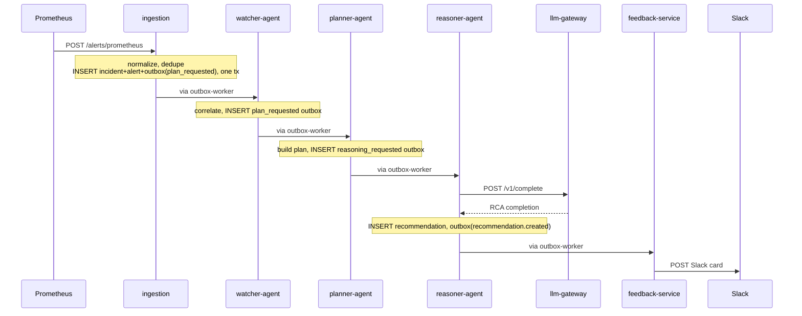
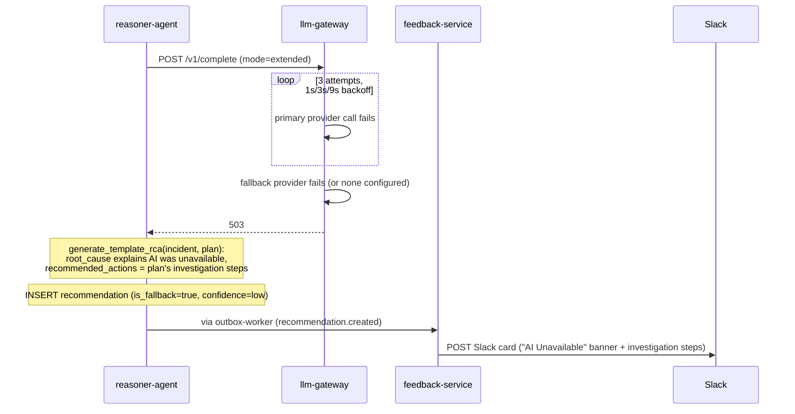
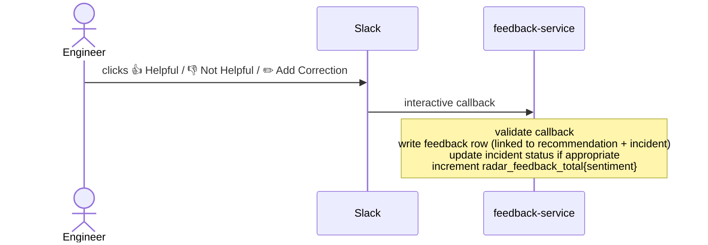
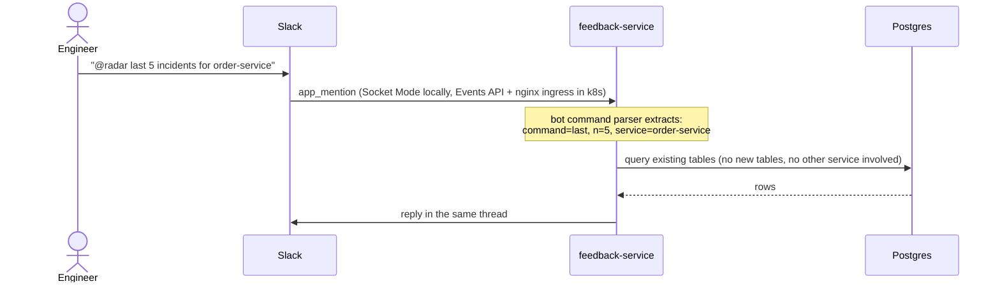

# Sequence Flows

## 1. Happy Path: Alert to RCA in Slack



Every arrow labeled "via outbox-worker" is: agent commits state + outbox row in one
transaction → outbox-worker polls, claims the row (`FOR UPDATE SKIP LOCKED`), and
`POST /events` to the next agent. Agents never call each other directly.

## 2. Deduplication

```
POST /alerts/mock  (OrderProcessingFailureRate, order-service)
  → fingerprint = sha256("order-service:OrderProcessingFailureRate:critical")
  → no open incident with that fingerprint → new incident + outbox event created

POST /alerts/mock  (same alert, 90 seconds later)
  → same fingerprint
  → open incident found within the correlation window (default 5 minutes)
  → alert_count incremented, alert attached to existing incident
  → no new outbox event, no new plan, no new RCA
```

The second POST produces no pipeline work. The engineer sees one incident, not two.

## 3. LLM Fallback



No incident is ever left without a recommendation, even during a full LLM provider
outage. See [docs/adr/0004-llm-gateway.md](../adr/0004-llm-gateway.md).

## 4. Feedback Loop



## 5. Slack Bot Query



## 6. Outbox Retry and Dead Lettering

```
outbox-worker dispatches event → target agent unreachable / 5xx
  attempt 1: immediate            → fails
  attempt 2: retry at NOW()+5s    → fails
  attempt 3: retry at NOW()+15s   → fails
  attempt 4: retry at NOW()+60s   → fails
  attempt 5: retry at NOW()+300s  → fails
  attempt 6: status → dead_letter, audit_log entry written, metric emitted
```

A dead lettered event stops retrying automatically but is never deleted. It stays
inspectable and requeueable through the outbox worker's admin endpoints.
