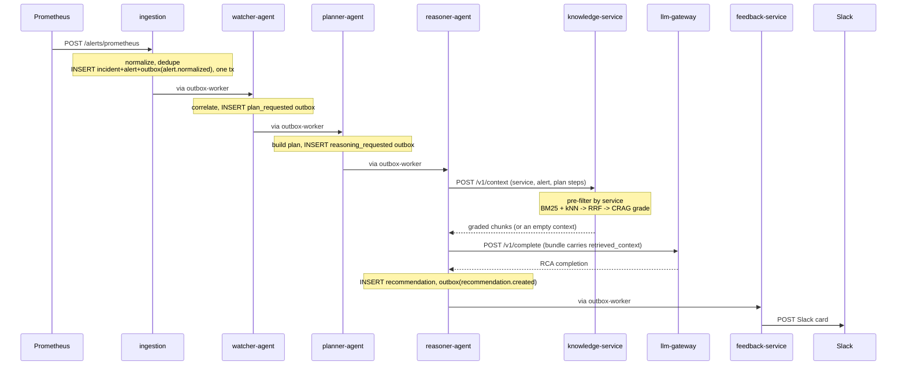
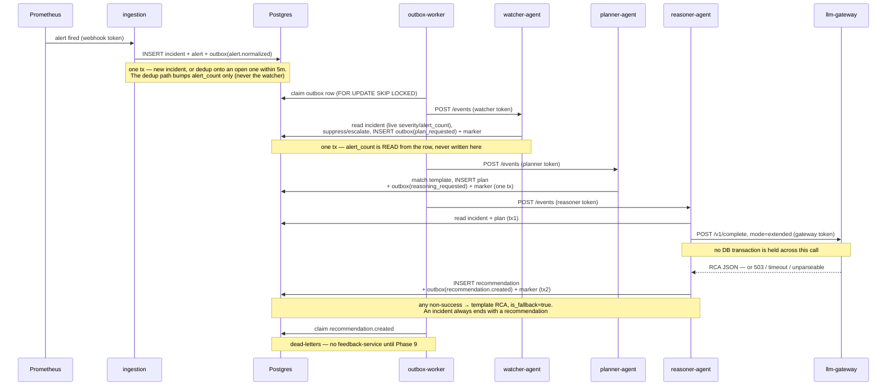
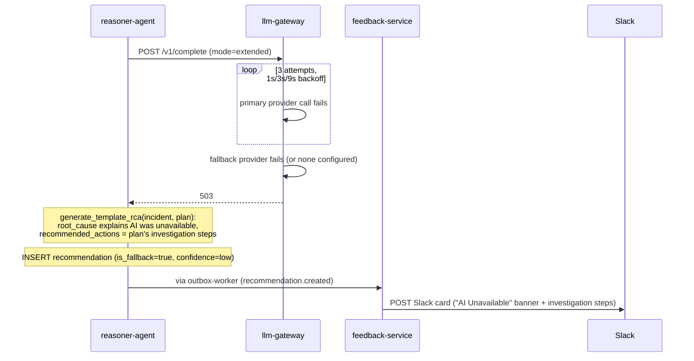
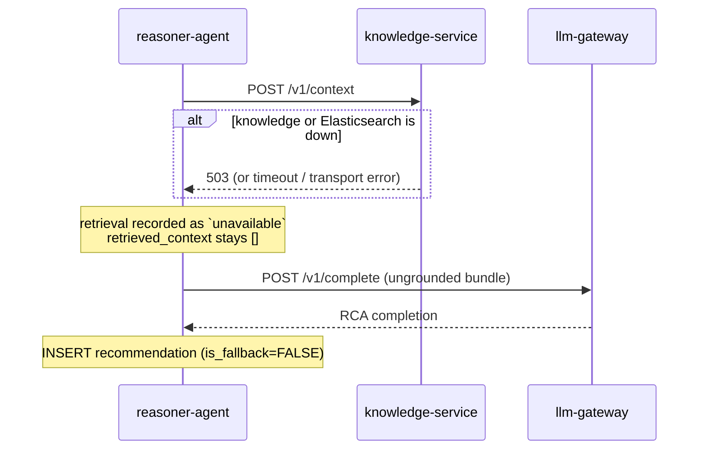
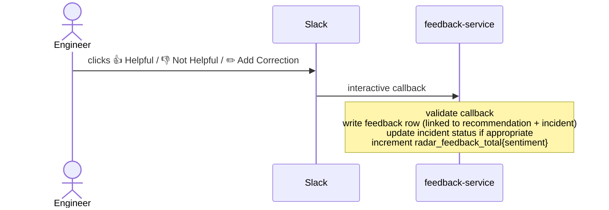
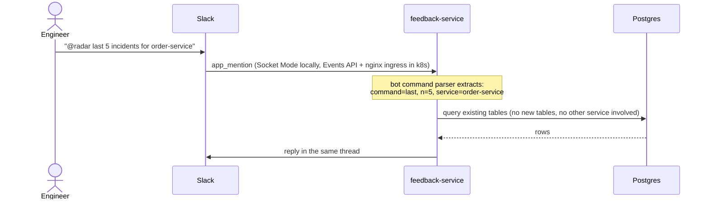

# Sequence Flows

## 1. Happy Path: Alert to RCA in Slack



The knowledge call is a DIRECT HTTP call, not an outbox hop, and that is not an
exception to the no-direct-HTTP rule: the rule governs AGENT-TO-AGENT handoffs,
which are pipeline state transitions. The knowledge service is not an agent in
the pipeline — it consumes no events and emits none. The reasoner queries it the
same way it queries the llm-gateway.

**Retrieval has three outcomes, and the reasoner keeps them apart:**

| outcome | what the model sees | why it matters |
|---|---|---|
| grounded | the graded chunks | the RCA can cite the runbook |
| empty (`200`, no chunks) | an empty slot | CRAG judged nothing relevant — the RCA says no runbook covers this |
| unavailable (`503`, timeout, transport) | an empty slot | retrieval FAILED; the corpus may well cover it |

The last two are identical to the model, deliberately — it should reason the same
way either time. The difference is recorded on the stored context bundle, so an
RCA's grounding state stays auditable.

Every arrow labeled "via outbox-worker" is: agent commits state + outbox row in one
transaction → outbox-worker polls, claims the row (`FOR UPDATE SKIP LOCKED`), and
`POST /events` to the next agent. Agents never call each other directly.

## 1a. Full Pipeline Detail: outbox-worker, transactions, and fallback

The same happy path as (1), with the outbox-worker hops, the Postgres transactions, and
the reasoner's fallback made explicit — the view that matters when reasoning about
atomicity and the correlation chain.



Two details this view makes precise:

- **`alert_count` belongs to ingestion.** It is bumped only on ingestion's dedup path;
  the watcher *reads* it live from the incidents row and never writes it (its escalation
  counts timestamped arrivals in a window, not the running total). See
  [ADR 0013](../adr/0013-watcher-correlation-scope.md).
- **The reasoner splits its work across two transactions.** It reads in `tx1`, calls the
  gateway with **no transaction open** (the call can take tens of seconds), then writes
  the recommendation, its outbox event, and the marker together in `tx2`. A crash during
  the call leaves no marker, so the event is simply redelivered.

The one correlation id minted at ingress is written on every row in this flow —
`incidents`, `investigation_plans`, `recommendations`, `audit_log`, and every
`outbox_events` row — so an incident is traceable end-to-end by that value alone.

## 2. Deduplication

```
POST /alerts/mock  (OrderProcessingFailureRate, order-service)
  → fingerprint = sha256("order-service:OrderProcessingFailureRate:critical")
  → no open incident with that fingerprint → new incident + outbox event created

POST /alerts/mock  (same alert, 90 seconds later)
  → same fingerprint
  → open incident found within the correlation window (default 5 minutes)
  → alert_count incremented, alert attached to existing incident
  → no new outbox event, no new plan, no new RCA
```

The second POST produces no pipeline work. The engineer sees one incident, not two.

## 3. LLM Fallback



No incident is ever left without a recommendation, even during a full LLM provider
outage. See [docs/adr/0004-llm-gateway.md](../adr/0004-llm-gateway.md).

### 3a. Retrieval degradation — a different failure, a different cost

The knowledge call has its own failure path, and it costs strictly less: the
reasoner proceeds with an EMPTY `retrieved_context` and still calls the LLM, so
the incident gets a real RCA that is merely ungrounded — not a template.



Two degradations, ordered by what they cost the incident:

- **retrieval unavailable** → an ungrounded but genuine LLM analysis.
- **LLM unavailable** → the template RCA of §3, which is the last resort.

The reasoner's knowledge budget (20s) is deliberately shorter than the knowledge
service's own CRAG budget (30s): a pathologically slow grading call costs the
incident its grounding rather than the worker's dispatch margin. Both budgets
live in `radar_common.timeouts`, where an import-time assertion keeps their sum
below the outbox worker's dispatch timeout.

## 4. Feedback Loop



## 5. Slack Bot Query



## 6. Outbox Retry and Dead Lettering

```
outbox-worker dispatches event → target agent unreachable / 5xx
  attempt 1: immediate            → fails
  attempt 2: retry at NOW()+5s    → fails
  attempt 3: retry at NOW()+15s   → fails
  attempt 4: retry at NOW()+60s   → fails
  attempt 5: retry at NOW()+300s  → fails
  attempt 6: status → dead_letter, audit_log entry written, metric emitted
```

A dead lettered event stops retrying automatically but is never deleted. It stays
inspectable and requeueable through the outbox worker's admin endpoints.
