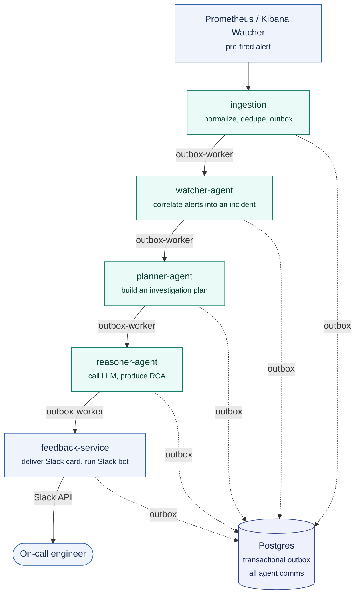

# 🏗️ System Overview

## Contents

- 🎯 [Purpose](#purpose)
- 🛒 [Domain](#domain)
- 🧩 [Services](#services)
- 🔀 [Data and Control Flow](#data-and-control-flow)
- 🧵 [Cross-Cutting Concerns](#cross-cutting-concerns)
- 🚀 [Deployment Target](#deployment-target)
- 🚫 [Non-Goals](#non-goals)

## Purpose

RADAR is an Incident Intelligence Platform. It sits downstream of detection systems
(Prometheus, Kibana Watcher) and upstream of the on-call engineer. Its job is
correlation, reasoning, and delivery. Not detection.

## Domain

The target system is an e-commerce platform, stubbed as a single `order-service` for
local development. Realistic alert scenarios:

```
OrderProcessingFailureRate    order failure rate > 5% for 1 minute
CheckoutTimeoutRate           checkout timeout rate > 3% for 2 minutes
InventoryCheckLatency         inventory service p95 latency > 2s
PaymentGatewayErrorRate       payment gateway errors > 2% for 1 minute
OrderServiceHighMemory        order-service memory usage > 85%
```

Runbooks under `docs/runbooks/` cover these scenarios with realistic investigation
steps, and are RAG-indexed by the knowledge-service for the reasoner to draw on.

## Services

All services live in the `radar` namespace in Kubernetes; platform dependencies live in
`radar-infra`.

```
ingestion           Receives alerts from Prometheus/Kibana, normalizes, dedupes,
                     writes the first outbox event.
llm-gateway          Single point of contact with LLM providers. Owns token IAM,
                     per-mode routing, retries, and provider fallback.
outbox-worker        Polls the Postgres outbox table and dispatches events to the
                     next agent over HTTP, with retries and dead-lettering.
watcher-agent        Correlates alerts into incidents using configurable rules.
planner-agent        Builds an investigation plan from a template.
reasoner-agent        Calls the LLM gateway to produce a root cause analysis, or
                     falls back to a template-based RCA if the LLM is unavailable.
knowledge-service     Indexes runbooks and serves retrieval to the reasoner (Phase 8+).
feedback-service      Delivers RCA cards to Slack, collects feedback, and runs the
                     Slack bot that answers status queries.
```

## Data and Control Flow

Detection is external. RADAR's flow starts at ingestion:



Note: `reasoner-agent` also calls `llm-gateway` directly via `POST /v1/complete` — that hop is a
direct call, not mediated by the outbox, and is omitted above for clarity.

All agent-to-agent communication is mediated by the Postgres transactional outbox.
There is never direct HTTP between agents. See
[docs/architecture/agent-pipeline.md](agent-pipeline.md) and
[docs/adr/0003-postgres-outbox.md](../adr/0003-postgres-outbox.md).

## Cross-Cutting Concerns

```
Secrets        HashiCorp Vault, injected via init-container only. No sidecars,
               no secrets in env vars at rest.
Auth           Static per-agent token (X-Radar-Agent-Token) for internal calls.
               Separate per-source webhook token (X-Radar-Webhook-Token) for
               external inbound alerts.
Observability  structlog JSON logs → Fluent Bit → Elasticsearch. Prometheus scrapes
               /metrics. OTel spans → OTel Collector → Elasticsearch, viewed in
               Kibana APM. Every log line and span carries correlation_id.
Notifications  Slack only, owned entirely by feedback-service.
```

The telemetry plane (the three signals, and the split between watching the simulated
shop versus watching RADAR itself) is drawn in
[observability.md](observability.md).

## Deployment Target

Two targets, from the same multi-arch images: the two-stack Docker deployment
(`radar-infra` + `radar-apps`) for local end-to-end runs, and an ephemeral managed
Kubernetes (K3s) cluster for the k8s path (Phase 12). Images build for `linux/amd64`
(the cluster, x86 CI) and `linux/arm64` (local Docker on Apple Silicon) via `docker buildx`.

## Non-Goals

- RADAR does not detect anomalies. Prometheus and Kibana own that.
- RADAR does not remediate automatically. It recommends.
- RADAR does not create tickets. Incident state lives entirely in Postgres.
- RADAR does not adopt an agent framework. The three stage pipeline is hand rolled.
