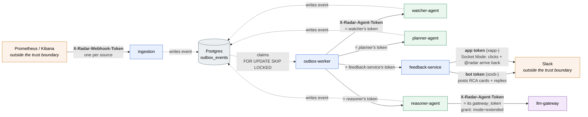
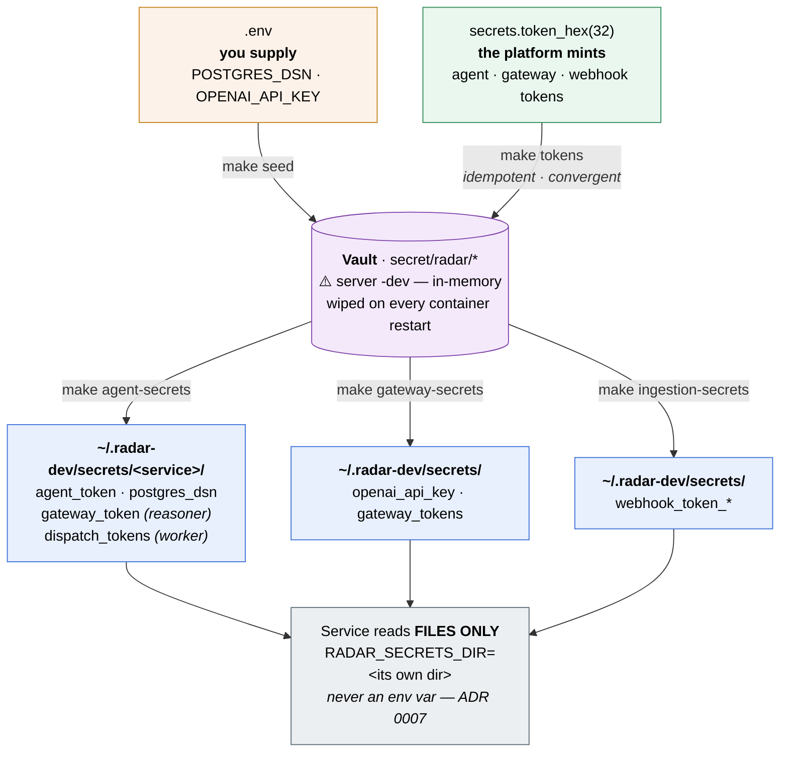
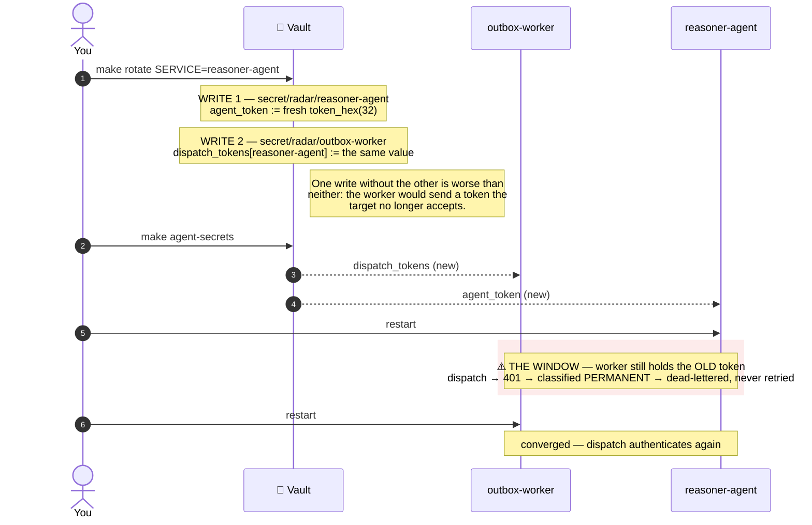

# 🧑‍💻 Local Development

From a clean laptop to six running services in about **ten minutes**, most of
that spent pulling Docker images while you grab a coffee. One script does the
setup, one command starts the stack, and nothing secret ever touches the repo.

---

## 🎯 TL;DR

```bash
scripts/bootstrap.sh   # checks tools, installs uv, generates .env, syncs deps
make dev               # start the whole stack
make ps                # watch all six services go healthy
```

That's the happy path. The rest of this guide explains each step, what it does
under the hood, and how to dig yourself out when something goes sideways.

---

## 🧰 Prerequisites

Install these three yourself first. The bootstrap script **checks** for each one
and tells you precisely what's missing, but it won't install them for you
(they need a GUI or root, which a repo script has no business doing silently).

| Tool | Version | Check it |
|---|---|---|
| 🐍 **Python** | 3.12 or newer | `python3 --version` |
| 🐳 **Docker** | any recent | Docker Desktop (macOS) · Docker Engine (Linux) |
| 📦 **Docker Compose** | v2 plugin | `docker compose version` |

Everything else (`uv` and the entire Python dev toolchain) is installed for
you in the steps below.

---

## 🚀 Step 1: Bootstrap

From the repository root:

```bash
scripts/bootstrap.sh
```

Here's what happens, in order:

| # | Action | Detail |
|---|---|---|
| 1️⃣ | **Verify prerequisites** | Python ≥ 3.12, Docker, Compose v2; fails early with instructions if anything is missing |
| 2️⃣ | **Install `uv`** | via the official Astral installer into `~/.local/bin`, only if not already present |
| 3️⃣ | **Generate `.env`** | random per-machine secrets for Postgres, Vault, and Grafana; mode `600`, gitignored, never overwritten |
| 4️⃣ | **Run `make setup`** | `uv sync` builds `.venv/` from `uv.lock`, then `pre-commit install` wires up the git hooks |

> 💡 **Idempotent by design.** Re-run `scripts/bootstrap.sh` as often as you
> like. It never clobbers an existing `.env` and skips anything already done.

---

## 🔑 Step 2: Add your external credentials

Bootstrap generates every *internal* secret for you. Three *external* ones are
yours to supply. Open `.env` and replace the `__SET_ME__` placeholders:

```bash
OPENAI_API_KEY=...      # your OpenAI API key
SLACK_BOT_TOKEN=...     # xoxb-...  from your Slack app   (needed from Phase 9)
SLACK_APP_TOKEN=...     # xapp-...  for Socket Mode       (needed from Phase 9)
```

You don't need these to boot the local stack; only the phases that actually
call an LLM or Slack do.

> 🔒 **Never commit `.env` or paste its contents anywhere.** Every generated
> secret is unique to your machine. Lost it? Delete the file and re-run
> `scripts/bootstrap.sh` for a fresh set.

---

## 🟢 Step 3: Start the stack

```bash
make dev
```

Six containers come up via Docker Compose. Every port binds to `127.0.0.1`
**only**, so the dev stack is never exposed to your network.

| Service | Version | URL | Credentials |
|---|---|---|---|
| 🐘 **Postgres** | 16 | `localhost:5432` | user `radar`, password in `.env` |
| 🔎 **Elasticsearch** | 8.16.0 | http://localhost:9200 | none · security off, localhost only |
| 📊 **Kibana** | 8.16.0 | http://localhost:5601 | none |
| 🔥 **Prometheus** | v2.55.0 | http://localhost:9090 | none |
| 📈 **Grafana** | 11.3.0 | http://localhost:3000 | `admin`, password in `.env` |
| 🔐 **Vault** | 1.18.0 *(dev)* | http://localhost:8200 | root token in `.env` |

> ⏳ **First run pulls ~3–4 GB of images.** Every start after that takes
> seconds.

### ✅ Verify everything is up

```bash
make ps
```

All six should report `healthy` (Elasticsearch and Kibana take 30–60s to get
there). Prefer to spot-check by hand?

```bash
curl -s http://localhost:9200/_cluster/health   # Elasticsearch
curl -s http://localhost:9090/-/healthy          # Prometheus
curl -s http://localhost:8200/v1/sys/health      # Vault
```

---

## 🎛️ Everyday commands

Stack-wide:

| Command | What it does |
|---|---|
| `make dev` · `make dev-infra` | start the container stack (detached) |
| `make stop` | stop the stack, **keep** data |
| `make clean` | stop the stack and **delete all data volumes** |
| `make ps` | status and health of all services |
| `make lint` | `ruff check` + `mypy` over the workspace |
| `make test` | run pytest |
| `make setup` | re-sync dependencies and reinstall hooks |

Single service: pass `s=<service>` where `<service>` is one of `postgres`,
`elasticsearch`, `kibana`, `prometheus`, `grafana`, `vault`:

| Command | What it does |
|---|---|
| `make start s=postgres` | start (or create) one service |
| `make stop-one s=kibana` | stop one service, leave the rest running |
| `make restart s=grafana` | restart one service |
| `make logs s=vault` | follow one service's logs (`make logs` for all) |

> 💾 **Your data is safe across restarts.** Postgres tables, Elasticsearch
> indices, and Grafana state survive `make stop` → `make dev`. Only
> `make clean` wipes them.

> ⚠️ **Vault is the exception.** It runs `server -dev`, which is **in-memory**:
> every secret is gone the moment its container restarts — no volume, no
> `make clean` required. This is not a problem, it is the reason `make seed` and
> `make tokens` exist: they rebuild Vault from nothing. If a service suddenly
> reports `/readyz` 503 on a missing secret, an emptied Vault is the first thing
> to suspect. See [Tokens and secrets](#-tokens-and-secrets) below.

Database migrations (Alembic, against the compose Postgres):

| Command | What it does |
|---|---|
| `make migrate` | apply all pending migrations (`upgrade head`) |
| `make migrate-check` | verify models and migrations are in sync |
| `make migrate-down` | roll back the most recent migration |
| `make revision m="add foo table"` | autogenerate a new migration from model changes |

Tokens and secrets — see [Tokens and secrets](#-tokens-and-secrets) for what these
mean and when you need them:

| Command | What it does |
|---|---|
| `make seed` | write the human-supplied secrets (DSN, API key) from `.env` into Vault |
| `make tokens` | mint every platform token into Vault (idempotent — keeps what exists) |
| `make rotate SERVICE=reasoner-agent` | replace one service's tokens, and the worker's map entry for it |
| `make agent-secrets` | pull each agent's secrets into `~/.radar-dev/secrets/<service>/` |
| `make gateway-secrets` | pull the gateway's API key and token map |
| `make ingestion-secrets` | pull the per-source webhook tokens |
| `make dev-apps` | start the eight app processes |
| `make stop-apps` | stop them |
| `make ps-apps` | readiness table |
| `make logs-apps` | tail all eight logs |
| `make index` | index `docs/runbooks/` into Elasticsearch (incremental) |

---

## 🔐 Tokens and secrets

RADAR services authenticate to each other with tokens, and read every secret from
a **file** — never an environment variable, locally or in production (ADR 0007).
Locally, `make` plays the part the Kubernetes init-container plays in the cluster.

### Who presents what, to whom

Every arrow that crosses a service boundary carries a credential. There is no
ambient trust and no shared master token: each arrow below is a *different* secret.



Three things this picture is making precise:

- **The worker sends the *target's* token, not its own.** It is the only caller of
  any `/events` endpoint, so it holds all four (watcher, planner, reasoner,
  feedback-service). That is not a hole in the per-service model — it is forced by
  it, and the worker can already forge any event it likes. What per-service tokens
  buy is still real: a token leaked from the watcher opens the watcher, and nothing
  else.
- **Solid arrows are authenticated HTTP; dashed arrows are the outbox.** Agents never
  call each other. A handoff is a row in Postgres, written in the same transaction as
  the state change that caused it (ADR 0003).
- **feedback-service is the pipeline's outward edge.** It consumes
  `recommendation.created` from the worker like any agent, then crosses one more
  boundary — to Slack — with its **own two tokens**: a bot token (`xoxb-`) to post
  RCA cards and threaded replies, and an app-level token (`xapp-`) to open the Socket
  Mode connection that carries button clicks and `@radar` mentions back. Two tokens
  because they authorize different things (posting vs. the socket) — the same
  per-credential discipline as agent vs. gateway.

### The two token systems

They share a header name (`X-Radar-Agent-Token`) and nothing else. Confusing them
is the most common way to get a mystifying 401.

| | **Agent token** | **Gateway token** |
|---|---|---|
| Guards | a service's `POST /events` (and the worker's `/admin/*`) | the LLM gateway's `/v1/complete` |
| Who has one | every service — **a different value each** | only services that call an LLM |
| Validated against | that service's own token | a token→grant map (`service` + one `allowed_mode`) |
| Wrong token | 401 | 401 |
| Right token, wrong mode | — | **403** |

A service that does both (the reasoner) holds **two different values**: an
`agent_token` (its identity on the event bus) and a `gateway_token` (its authority
to spend `extended`). They rotate independently, because they are authority over
different things.

The outbox-worker is the only caller of any `/events` endpoint, so it holds
`dispatch_tokens` — a map of *every target's* token — and sends **the target's**,
never its own.

### The four commands

```bash
make seed      # what a HUMAN supplies:   postgres_dsn, openai_api_key (from .env)
make tokens    # what the PLATFORM mints: agent tokens, dispatch map,
               #                          gateway grants, webhook tokens
make agent-secrets      # pull -> ~/.radar-dev/secrets/<service>/
make gateway-secrets    # pull -> ~/.radar-dev/secrets/  (gateway + api key)
make ingestion-secrets  # pull -> ~/.radar-dev/secrets/  (webhook_token_*)
```

`seed` and `tokens` **write to Vault**; the `*-secrets` targets **read from it**
into files. That split is deliberate: seeding only copies values that already exist
in `.env`, so it can never invent or invalidate a credential; minting generates
them, and **never clobbers** — an existing token is kept, so `make tokens` is safe
to run on a clean machine, a half-configured one, or twice in a row.



The two write-paths never overlap, and that is what makes them safe to re-run: `seed`
can only copy what already exists, `tokens` can only add what is missing. Between
them, an **empty Vault is fully recoverable** — which matters, because it empties
itself every time its container restarts.

`make tokens` is also **convergent**: it rebuilds `dispatch_tokens` from the
per-service tokens on every run. The map is *derived*, never authored, so it cannot
drift from the secrets it points at. That matters more than it sounds — a drifted
map means every dispatch to that target 401s, and the worker treats a 401 as
*permanent*: the event is dead-lettered immediately, with no retry.

### Where the files land

One directory per service, mirroring its per-pod Vault mount in production:

```
~/.radar-dev/secrets/
├── watcher-agent/    agent_token, postgres_dsn
├── planner-agent/    agent_token, postgres_dsn
├── reasoner-agent/   agent_token, gateway_token, postgres_dsn
├── outbox-worker/    agent_token, dispatch_tokens, postgres_dsn
├── feedback-service/ agent_token, postgres_dsn, slack_bot_token, slack_app_token
├── openai_api_key         ┐
├── gateway_tokens         ├─ flat: the gateway and ingestion still read these
└── webhook_token_*        ┘
```

Each service launches with `RADAR_SECRETS_DIR` pointed at **its own** directory.
It has to be per-service: every service reads its token from a file with a fixed
name (`agent_token`), so two services sharing a directory would share one file and
therefore one token — silently collapsing per-service tokens back into the shared
secret they exist to replace.

### Rotating one service's tokens

```bash
make rotate SERVICE=reasoner-agent   # fresh agent token + gateway token
make agent-secrets                   # pull the new files
# restart reasoner-agent AND outbox-worker
```

Rotation performs **two writes**: the service's own token, and the worker's
`dispatch_tokens` entry pointing at it. The second is what makes the first useful —
without it the worker keeps sending a token the target no longer accepts.



> ⚠️ **Rotation is not hot.** That red window is real: a 401 is *permanent*, so
> events dispatched during it are **dead-lettered, not retried**. Rotate on a
> drained pipeline — check outbox depth first. (Two-phase `[old, new]` acceptance
> closes the window if hot rotation is ever needed; see the carried-debt table in
> [roadmap.md](roadmap.md).)

Recovering a dead-lettered event afterwards:

```bash
curl -s -H "X-Radar-Agent-Token: $(cat ~/.radar-dev/secrets/outbox-worker/agent_token)" \
  localhost:8080/admin/dead-letters
curl -s -X POST -H "X-Radar-Agent-Token: $(cat ~/.radar-dev/secrets/outbox-worker/agent_token)" \
  localhost:8080/admin/dead-letters/<event_id>/requeue
```

### Rotating the Vault root token

`VAULT_DEV_ROOT_TOKEN` opens *everything* in the dev Vault, so it's the one worth
knowing how to replace by hand.

**1.** Generate a value and put it in `.env` (replacing `VAULT_DEV_ROOT_TOKEN=`):

```bash
python3 -c "import secrets; print(secrets.token_hex(32))"
```

**2.** **Recreate** the container — do **not** `make restart s=vault`:

```bash
docker compose --env-file .env -f deploy/compose/docker-compose.yml \
  up -d --force-recreate vault
```

> 🪤 **The trap.** Compose injects the token as `VAULT_DEV_ROOT_TOKEN_ID`, and
> environment is bound when a container is **created**. `docker compose restart`
> restarts the *same* container with the *same* environment — you would get a green
> Vault still honoring the old token, and believe you had rotated it. Only a
> recreate re-reads `.env`.

**3.** Prove it took. The `403` is the proof; the `404` means "authenticated, but
nothing stored yet" — Vault is empty, because recreating it wiped it:

```bash
curl -s -o /dev/null -w "old -> %{http_code}\n" -H "X-Vault-Token: <OLD>" \
  http://localhost:8200/v1/secret/metadata/radar    # expect 403
curl -s -o /dev/null -w "new -> %{http_code}\n" \
  -H "X-Vault-Token: $(grep '^VAULT_DEV_ROOT_TOKEN=' .env | cut -d= -f2-)" \
  http://localhost:8200/v1/secret/metadata/radar    # expect 404
```

**4.** Rebuild and pull:

```bash
make seed && make tokens
make agent-secrets && make gateway-secrets && make ingestion-secrets
```

**5.** Verify: a second `make tokens` should print `kept` for everything and mint
nothing.

Every token in Vault is regenerated by the wipe, so anything holding an old value
(a saved `curl`, a webhook caller) needs the new one from `~/.radar-dev/secrets/`.

### Rebuilding a wiped Vault

Same as steps 4–5 above — `make seed && make tokens`, then pull. This is the answer
whenever Vault comes back empty, which it does on every container recreate.

> 🤫 **These tools never print a secret value** — only service names and 6-character
> prefixes, enough to compare two tokens without exposing either. Follow the same
> rule by hand: a redaction you haven't tested is a redaction that will fail
> silently, and a value pasted into a terminal, a chat, or a PR comment is exposed
> even if you delete it afterwards. Rotate rather than reason about it.

---

## 🤖 Run the LLM gateway

From Phase 4 onward you can run the LLM gateway as a real local server and hit
it with curl:

```bash
make gateway
```

| Command / variable | What it does |
|---|---|
| `make gateway` | start the gateway on http://localhost:8081 (Ctrl-C to stop) |
| `make gateway-secrets` | re-pull API keys + token map from Vault into the secrets dir (run after any Vault change, then restart the gateway) |
| `GATEWAY_PORT=9000 make gateway` | pick a different port |
| `GATEWAY_SECRETS_DIR=...` | where the secret files live (default `~/.radar-dev/secrets`) |
| `GATEWAY_CONFIG=...` | mode config path (default `apps/llm-gateway/config/gateway.yaml`) |

**Changing the backing model or provider** is a config edit, not a code
change: open [`apps/llm-gateway/config/gateway.yaml`](../apps/llm-gateway/config/gateway.yaml),
set `provider:` / `model:` for any mode (openai · anthropic · gemini), restart
the gateway, done. Two rules: the matching API key file must exist in the
secrets dir, and anthropic modes must set `max_output_tokens`.

The gateway follows the platform's secret rule even locally: it reads
**Vault-sourced files**, never environment variables. Two secret files must
exist in `GATEWAY_SECRETS_DIR` (the target checks and tells you which one is
missing):

| File | Contents | Vault path it mirrors |
|---|---|---|
| `openai_api_key` | your OpenAI API key, one line | `secret/radar/llm` |
| `gateway_tokens` | YAML map: `tokens: {<64-hex>: {service, allowed_mode}}` | `secret/radar/llm-gateway` |

Both are put into Vault by `make seed` (the API key, from `.env`) and `make tokens`
(the token map, minted), then pulled to files by `make gateway-secrets` — the same
flow the Kubernetes init-container performs (ADR 0007). Rotate with
`make rotate SERVICE=<service>`, re-pull, and restart the gateway.

Smoke-test it:

```bash
curl -s localhost:8081/readyz                    # {"status":"ready"}; 503 means a secret or config is missing

# Every gateway token grants exactly ONE mode, so the token you send decides the
# mode you may ask for. reasoner-agent is granted `extended`; asking it for any
# other mode is a 403, not a 401 — the token is valid, the mode is not.
TOKEN=$(cat ~/.radar-dev/secrets/reasoner-agent/gateway_token)
curl -s localhost:8081/v1/complete \
  -H "X-Radar-Agent-Token: $TOKEN" \
  -H "Content-Type: application/json" \
  -d '{"mode":"extended","messages":[{"role":"user","content":"hello"}]}'
```

> 🔑 **Tokens come from a service's own directory.** Each service reads its secrets
> from `~/.radar-dev/secrets/<service>/`, mirroring its per-pod Vault mount in
> production. There is no general-purpose "dev token" that can call anything — a
> token exists because a service needs it, and it can do exactly what that service
> is allowed to do.

> 📡 **Harmless noise:** `Transient error … exporting traces to localhost:4317`
> means the OTel Collector isn't running locally. It arrives with the
> observability phase; requests are unaffected.

---

## 🔥 Run the whole pipeline

Eight processes: ingestion, the three agents, the outbox worker, the
llm-gateway, the knowledge service, and the feedback-service. `make dev-apps`
starts them all, tracks PIDs in `.dev-run/`, and prints a readiness table.

### From nothing to a working pipeline

```bash
scripts/bootstrap.sh                # tools, uv, .env, deps
# edit .env: set OPENAI_API_KEY
#            (+ SLACK_BOT_TOKEN and SLACK_APP_TOKEN for feedback-service — Phase 9)

make dev-infra                      # 6 containers
make ps                             # wait: all healthy
make migrate                        # schema

make seed && make tokens            # .env -> Vault, then mint tokens
make agent-secrets
make gateway-secrets
make ingestion-secrets

make dev-apps                       # 8 processes
make index                          # build the runbook index
make ps-apps                        # all 8 ready
```

`knowledge-service` reports **not ready** until `make index` has run — its
readiness check verifies the live index's vector dimension, and there is no
index before the first pass. It flips to ready on the next `make ps-apps`.

`feedback-service` (Phase 9) needs **real** Slack tokens to go ready: it opens a
Socket Mode connection at startup (before it reports ready), so a placeholder
`SLACK_APP_TOKEN` passes secret-load but fails the connect and holds `/readyz` at
503. Without a real Slack app it stays not-ready and `recommendation.created`
retries — the rest of the pipeline (ingestion → agents → reasoner) is unaffected.

> ⚠️ **Vault is dev-mode and in-memory.** `make stop-infra` wipes it. On every
> restart re-run `make seed && make tokens` and the three `*-secrets` pulls.
> Postgres and Elasticsearch use named volumes, so the index and past RCAs
> survive.

### Ports

| service | port | | service | port |
|---|---|---|---|---|
| llm-gateway | 8081 | | reasoner-agent | 8093 |
| ingestion | 8090 | | outbox-worker | 8094 |
| watcher-agent | 8091 | | knowledge-service | 8095 |
| planner-agent | 8092 | | feedback-service | 8096 |

### Complete e2e test

Test the full pipeline by firing alerts that exercise three scenarios: retrieval-grounded RCAs,
ungrounded RCAs (no runbook match), and LLM fallback (gateway down). The complete test takes
~60 seconds:

```bash
TOK=$(cat ~/.radar-dev/secrets/ingestion/webhook_token_mock)
fire() { curl -s -X POST http://127.0.0.1:8090/alerts/mock \
  -H "X-Radar-Webhook-Token: $TOK" -H "Content-Type: application/json" -d "$1"; echo; }

# Test 1: grounded — runbook found, 5 chunks retrieved
echo "=== Test 1: Grounded RCA (with runbook) ==="
fire '{"service_name":"order-service","alert_name":"OrderServiceHighMemory","severity":"medium"}'

# Test 2: ungrounded — right service, no runbook covers this
echo "=== Test 2: Ungrounded RCA (no runbook) ==="
fire '{"service_name":"inventory-service","alert_name":"InventoryCustomerPiiExposedInLogs","severity":"high"}'

# Test 3: fallback — LLM gateway is down, use synthesis fallback
echo "=== Test 3: Fallback RCA (LLM unavailable) ==="
kill $(cat .dev-run/llm-gateway.pid)
sleep 1
fire '{"service_name":"checkout-service","alert_name":"CheckoutTimeoutRate","severity":"high"}'
```

Each alert takes ~20–30s for the LLM to process. Use a different service per scenario: a repeat
within 5 minutes deduplicates onto the open incident instead of creating a new one.

**Verify the results** after ~60 seconds (all three scenarios complete):

```sql
SELECT is_fallback, llm_provider, confidence,
       context_bundle->'retrieval'->>'outcome' AS retrieval,
       jsonb_array_length(context_bundle->'bundle'->'retrieved_context') AS chunks,
       left(root_cause, 80)
FROM recommendations ORDER BY created_at DESC LIMIT 3;
```

Expected:

| is_fallback | llm_provider | confidence | retrieval | chunks | root_cause |
|---|---|---|---|---|---|
| `f` | `openai` | `medium` | `unavailable` | 0 | AI analysis unavailable … (fallback, gateway down) |
| `f` | `openai` | `medium` | `empty` | 0 | No runbook covers … (ungrounded) |
| `f` | `openai` | `high` | `grounded` | 5 | The high memory usage … (grounded, retrieval worked) |

### Read the results

```sql
SELECT is_fallback, llm_provider, confidence,
       context_bundle->'retrieval'->>'outcome' AS retrieval,
       jsonb_array_length(context_bundle->'bundle'->'retrieved_context') AS chunks,
       left(root_cause, 80)
FROM recommendations ORDER BY created_at DESC LIMIT 3;
```

| scenario | retrieval | chunks | row |
|---|---|---|---|
| grounded | `grounded` | 5 | RCA cites the runbook's specifics |
| no coverage | `empty` | 0 | RCA states no runbook covers it |
| gateway down | `unavailable` | 0 | `is_fallback=t`, `llm_provider=none` |

`empty` means the grader judged nothing relevant; `unavailable` means retrieval
failed. Both leave the context empty — the distinction is recorded so an RCA's
grounding is auditable.

Trace one incident end to end:

```sql
SELECT event_type, actor, created_at FROM audit_log
  WHERE correlation_id = (SELECT correlation_id FROM incidents ORDER BY opened_at DESC LIMIT 1)
  ORDER BY created_at;
```

`recommendation.created` is delivered by feedback-service (Phase 9): it posts the
RCA card to Slack and moves the incident to `investigating`, adding
`notification.delivered` and `incident.investigating` to the trail above. (It only
delivers when feedback-service is ready — i.e. real Slack tokens are set; otherwise
the event retries and dead-letters, correct then and still requeueable.)

### Everyday use

```bash
make ps-apps        # readiness table
make logs-apps      # tail all eight
make stop-apps      # stop the apps
make stop-infra     # stop the containers
```

`make dev`/`make stop` remain aliases for `dev-infra`/`stop-infra`. The apps run
natively rather than in containers because that is the code you edit; `make stop`
does not touch them, which is what `make stop-apps` is for.

---

## 🪝 Git hooks

`pre-commit` runs automatically on every commit, so bad things never make it
into history:

- 🔦 **gitleaks**: blocks any commit that smells like a secret
- 🎨 **ruff** (lint + format): auto-fixes style on the way in
- 🧹 **hygiene**: trailing whitespace, YAML/TOML syntax, oversized files,
  private keys, stray merge-conflict markers

The first commit after setup is slow while pre-commit builds its isolated hook
environments; every commit after that is fast. Sweep the whole tree on demand:

```bash
uv run pre-commit run --all-files
```

---

## 🛟 Troubleshooting

<details>
<summary><strong><code>make dev</code> says ".env not found"</strong></summary>

Run `scripts/bootstrap.sh` first. Compose refuses to start without generated
credentials; there are no hardcoded defaults to fall back on.
</details>

<details>
<summary><strong>Elasticsearch is unhealthy or keeps exiting</strong></summary>

It needs ~1 GB free memory to itself. On Docker Desktop, bump the memory limit
(Settings → Resources) to at least **4 GB** for the whole stack.
</details>

<details>
<summary><strong>"Port already in use"</strong></summary>

Something already occupies 5432, 9200, 5601, 9090, 3000, or 8200. Stop the
other process, or edit the port mapping in
`deploy/compose/docker-compose.yml` (change the **left** side of the mapping
only).
</details>

<details>
<summary><strong>I lost or corrupted my <code>.env</code></strong></summary>

```bash
rm .env && scripts/bootstrap.sh
make clean && make dev
```

The `make clean` is **required**: Postgres, Grafana, and Vault cache the *old*
credentials inside their data volumes, so regenerating `.env` without wiping
volumes leaves them out of sync.
</details>

<details>
<summary><strong><code>uv: command not found</code> right after bootstrap</strong></summary>

The installer dropped `uv` into `~/.local/bin`, which may not be on the `PATH`
of already-open shells. Open a new terminal, or:

```bash
export PATH="$HOME/.local/bin:$PATH"
```
</details>

<details>
<summary><strong><code>feedback-service</code> stays DOWN or not-ready after <code>make dev-apps</code></strong></summary>

The feedback-service opens a real Socket Mode connection to Slack at startup and
does not report ready until it succeeds. This is deliberate: a bot that cannot
hear button clicks and mentions is broken from the start, and discovering that
when an incident card is already in the channel is worse than refusing to go
ready.

**Check your Slack tokens are valid:**

1. Verify `SLACK_BOT_TOKEN` and `SLACK_APP_TOKEN` in `.env` are real (not
   placeholders like `__SET_ME__`). They must be from an actual Slack workspace
   where the RADAR bot is installed.
2. Confirm the bot has permissions: **Socket Mode** enabled at the app level, and
   the bot user scope includes `app_mentions:read` and `reactions:write`.
3. Check the logs: `tail .dev-run/feedback-service.log` for the actual error —
   common issues are revoked tokens, missing app-level Socket Mode permissions,
   or network timeouts.

**If tokens are valid but the connection hangs**, it may be a network issue or
the Slack SDK waiting on a timeout. Kill it and try again:

```bash
pkill -f "feedback-service"
make dev-apps  # restarts it
```

**If you have no real Slack workspace**, the rest of the pipeline works fine
without it: ingestion → watcher → planner → reasoner all run and produce
recommendations. Only the delivery step (posting RCA cards) is blocked. The
`recommendation.created` event retries in the outbox while feedback-service is
not ready, and succeeds once you plug in real credentials or until it
dead-letters (see "Recovering a dead-lettered event" above).
</details>

---

## 🧭 Where to go next

| Path | What's there |
|---|---|
| [`../README.md`](../README.md) | What RADAR is, the problem it solves, and how it works |
| [`roadmap.md`](roadmap.md) | The phase-by-phase build plan |
| [`architecture/`](architecture/) | System overview, agent pipeline, data model, sequence flows |
| [`implementation_plan.md`](implementation_plan.md) | The full technical specification |
